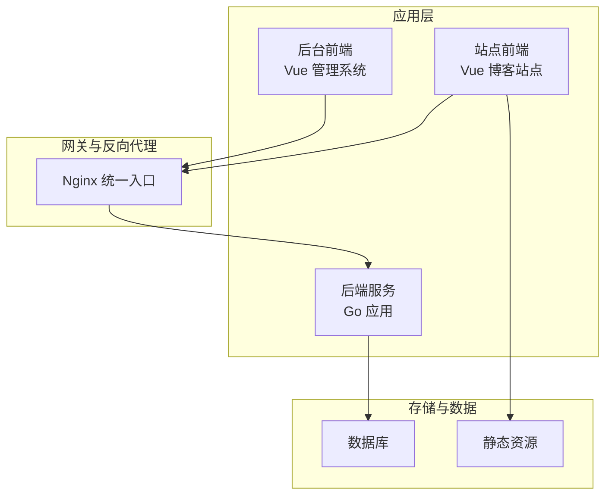
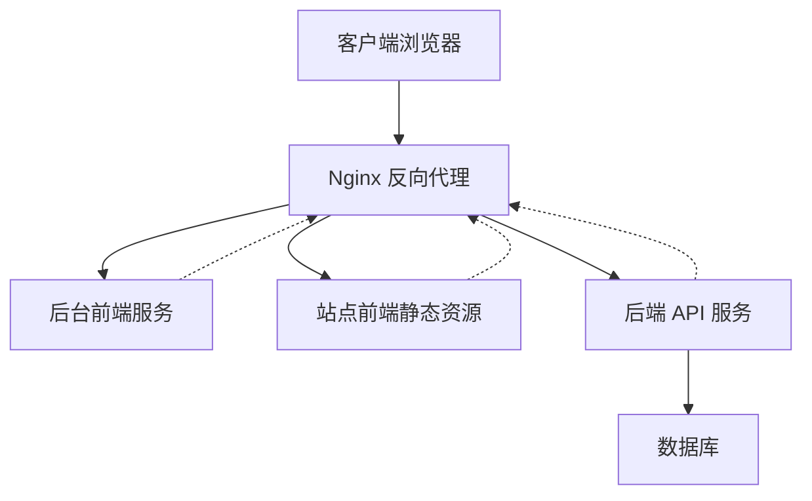
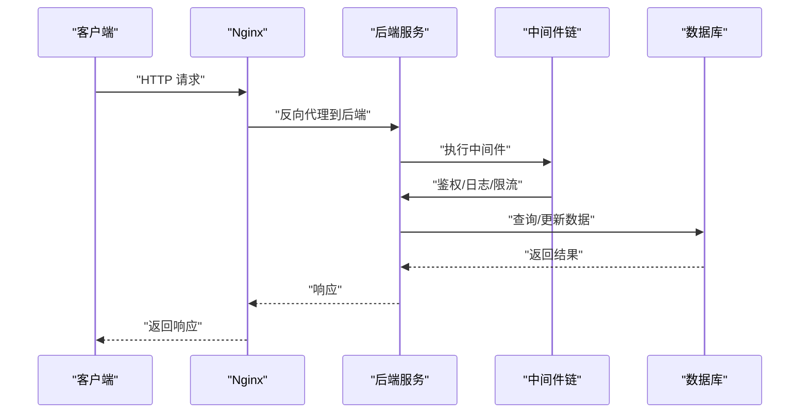
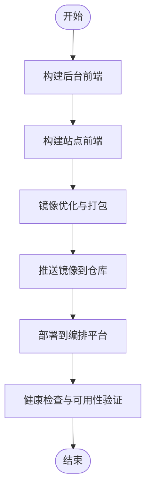
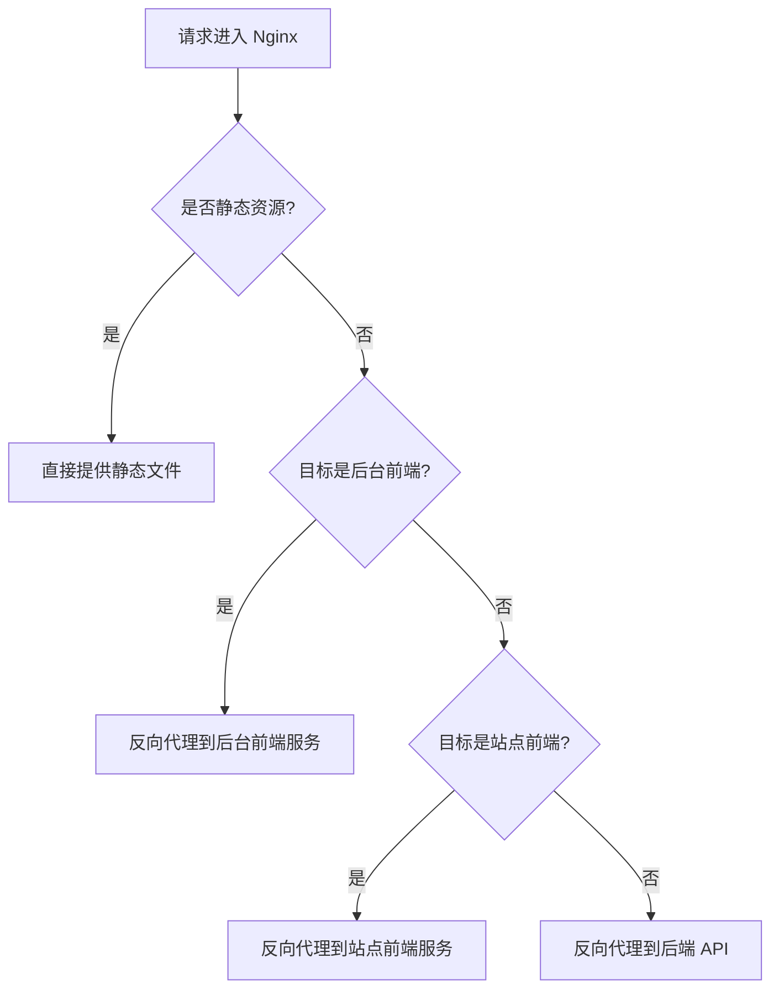
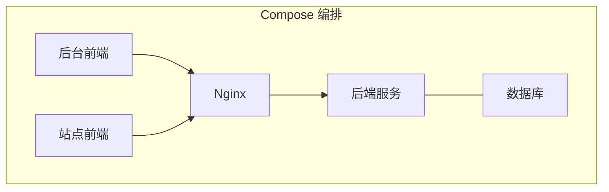
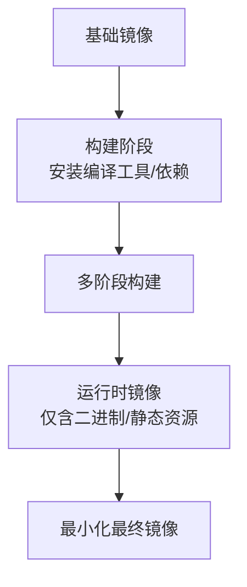
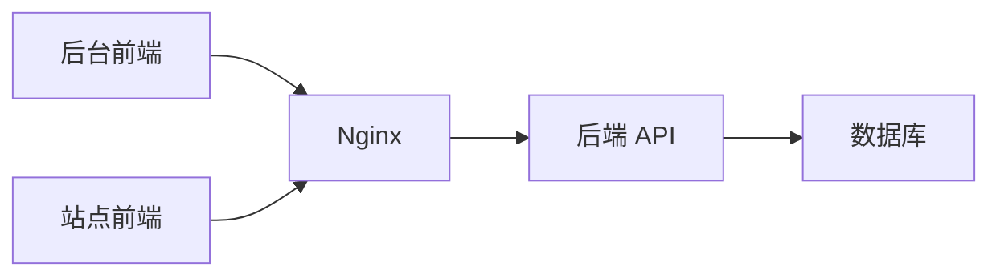

# 部署与监控

<cite>
**本文引用的文件**
- [Dockerfile](file://Dockerfile)
- [web/backend/Dockerfile](file://web/backend/Dockerfile)
- [web/frontend/Dockerfile](file://web/frontend/Dockerfile)
- [docker-compose.yaml](file://docker-compose.yaml)
- [nginx.conf.unified](file://nginx.conf.unified)
- [web/backend/nginx.conf](file://web/backend/nginx.conf)
- [web/frontend/nginx.conf](file://web/frontend/nginx.conf)
- [main.go](file://main.go)
- [.dockerignore](file://.dockerignore)
- [web/backend/.dockerignore](file://web/backend/.dockerignore)
- [web/frontend/.dockerignore](file://web/frontend/.dockerignore)
- [README.md](file://README.md)
- [web/frontend/package.json](file://web/frontend/package.json)
- [web/backend/package.json](file://web/backend/package.json)
</cite>

## 目录
1. [简介](#简介)
2. [项目结构](#项目结构)
3. [核心组件](#核心组件)
4. [架构总览](#架构总览)
5. [详细组件分析](#详细组件分析)
6. [依赖关系分析](#依赖关系分析)
7. [性能考量](#性能考量)
8. [故障排查指南](#故障排查指南)
9. [结论](#结论)
10. [附录](#附录)

## 简介
本文件面向 DevOps 工程师与运维人员，提供 YanBlog 的完整部署与监控方案。内容涵盖：
- Docker 多阶段构建与镜像优化
- docker-compose 编排与环境变量管理
- Nginx 反向代理与负载均衡策略
- 生产部署流程与回滚机制
- 性能监控、日志收集与错误追踪
- 自动化部署与 CI/CD 集成建议
- 容器编排与集群管理最佳实践
- 备份策略与灾难恢复计划

## 项目结构
YanBlog 采用前后端分离架构，后端为 Go 应用，前端分别为后台管理系统与站点前端。仓库中包含三处 Dockerfile（根目录、web/backend、web/frontend），以及统一的 Nginx 配置与 docker-compose 编排文件。

**章节来源**
- [docker-compose.yaml](file://docker-compose.yaml)
- [nginx.conf.unified](file://nginx.conf.unified)
- [web/backend/nginx.conf](file://web/backend/nginx.conf)
- [web/frontend/nginx.conf](file://web/frontend/nginx.conf)

## 核心组件
- 后端服务：基于 Go 的 API 服务，负责文章、分类、用户等业务接口。
- 前台管理前端：Vue 应用，提供文章编辑、媒体管理、系统配置等功能。
- 博客站点前端：Vue 应用，提供访客可见的文章列表、详情页等。
- Nginx：统一反向代理与静态资源分发。
- 数据库：由 compose 编排启动，供后端访问。
- 构建与打包：根级 Dockerfile 负责后端构建；前后端各自 Dockerfile 负责前端镜像构建与优化。

**章节来源**
- [main.go](file://main.go)
- [web/backend/Dockerfile](file://web/backend/Dockerfile)
- [web/frontend/Dockerfile](file://web/frontend/Dockerfile)
- [Dockerfile](file://Dockerfile)

## 架构总览
下图展示生产环境典型拓扑：Nginx 作为统一入口，将管理前端流量转发至后台前端服务，博客站点前端静态化部署，后端服务通过数据库提供数据。

**图表来源**
- [nginx.conf.unified](file://nginx.conf.unified)
- [web/backend/nginx.conf](file://web/backend/nginx.conf)
- [web/frontend/nginx.conf](file://web/frontend/nginx.conf)
- [docker-compose.yaml](file://docker-compose.yaml)

## 详细组件分析

### 后端服务（Go API）
- 运行入口：主程序入口文件定义了服务启动与路由注册。
- 配置与中间件：日志、CORS、JWT、限流等中间件在运行期生效。
- 数据模型：数据库连接与实体模型在运行期初始化。

**图表来源**
- [main.go](file://main.go)
- [middlewares/jwt.go](file://middlewares/jwt.go)
- [middlewares/Logger.go](file://middlewares/Logger.go)
- [middlewares/rate_limit.go](file://middlewares/rate_limit.go)
- [model/DB.go](file://model/DB.go)

**章节来源**
- [main.go](file://main.go)
- [middlewares/jwt.go](file://middlewares/jwt.go)
- [middlewares/Logger.go](file://middlewares/Logger.go)
- [middlewares/rate_limit.go](file://middlewares/rate_limit.go)
- [model/DB.go](file://model/DB.go)

### 前端管理与站点前端
- 构建产物：两套前端分别构建独立的静态资源。
- 静态托管：Nginx 将站点前端静态资源直接提供，后台前端通过反向代理转发到对应服务。
- 环境变量：前端通过构建时注入环境变量，用于 API 地址等配置。

**图表来源**
- [web/backend/Dockerfile](file://web/backend/Dockerfile)
- [web/frontend/Dockerfile](file://web/frontend/Dockerfile)
- [web/backend/package.json](file://web/backend/package.json)
- [web/frontend/package.json](file://web/frontend/package.json)

**章节来源**
- [web/backend/Dockerfile](file://web/backend/Dockerfile)
- [web/frontend/Dockerfile](file://web/frontend/Dockerfile)
- [web/backend/package.json](file://web/backend/package.json)
- [web/frontend/package.json](file://web/frontend/package.json)

### Nginx 反向代理与负载均衡
- 统一入口：Nginx 作为外部唯一入口，处理静态资源与反向代理。
- 路由规则：后台前端与站点前端的路径区分，避免冲突。
- 负载均衡：可扩展为多实例部署，结合健康检查实现自动切换。

**图表来源**
- [nginx.conf.unified](file://nginx.conf.unified)
- [web/backend/nginx.conf](file://web/backend/nginx.conf)
- [web/frontend/nginx.conf](file://web/frontend/nginx.conf)

**章节来源**
- [nginx.conf.unified](file://nginx.conf.unified)
- [web/backend/nginx.conf](file://web/backend/nginx.conf)
- [web/frontend/nginx.conf](file://web/frontend/nginx.conf)

### docker-compose 编排与环境变量
- 服务编排：compose 文件定义后端、数据库、Nginx 等服务及其网络与卷。
- 环境变量：通过环境变量传递数据库凭据、站点配置、API 地址等。
- 持久化：数据库与静态资源卷挂载，确保数据持久化。

**图表来源**
- [docker-compose.yaml](file://docker-compose.yaml)

**章节来源**
- [docker-compose.yaml](file://docker-compose.yaml)

### Docker 多阶段构建与镜像优化
- 后端镜像：根级 Dockerfile 使用多阶段构建，减少最终镜像体积。
- 前端镜像：前后端 Dockerfile 分离构建，利用 .dockerignore 排除无关文件。
- 最小化运行时：仅包含运行所需的二进制或静态资源，降低攻击面。

**图表来源**
- [Dockerfile](file://Dockerfile)
- [web/backend/Dockerfile](file://web/backend/Dockerfile)
- [web/frontend/Dockerfile](file://web/frontend/Dockerfile)

**章节来源**
- [Dockerfile](file://Dockerfile)
- [web/backend/Dockerfile](file://web/backend/Dockerfile)
- [web/frontend/Dockerfile](file://web/frontend/Dockerfile)
- [.dockerignore](file://.dockerignore)
- [web/backend/.dockerignore](file://web/backend/.dockerignore)
- [web/frontend/.dockerignore](file://web/frontend/.dockerignore)

## 依赖关系分析
- 组件耦合：后端服务与数据库强耦合；Nginx 作为弱耦合入口，解耦前端与后端。
- 外部依赖：数据库、静态存储、CI/CD 仓库。
- 可观测性：日志、指标、告警需贯穿所有组件。

**图表来源**
- [docker-compose.yaml](file://docker-compose.yaml)
- [nginx.conf.unified](file://nginx.conf.unified)

**章节来源**
- [docker-compose.yaml](file://docker-compose.yaml)
- [nginx.conf.unified](file://nginx.conf.unified)

## 性能考量
- 镜像体积：通过多阶段构建与精简运行时镜像降低拉取与启动时间。
- 静态资源：Nginx 提供静态资源缓存与压缩，提升加载速度。
- 并发与限流：后端中间件提供限流与日志记录，防止过载。
- 数据库优化：合理索引与连接池配置，避免慢查询。
- CDN 与缓存：可引入 CDN 加速静态资源，结合 Redis 缓存热点数据。

[本节为通用指导，无需列出具体文件来源]

## 故障排查指南
- 健康检查失败：检查 Nginx 反代路径与后端服务端口映射；确认后端日志输出。
- 数据库连接异常：核对数据库服务状态、凭据与网络连通性。
- 前端无法访问：确认静态资源路径与 Nginx 配置；检查构建产物是否正确上传。
- 日志定位：集中化日志收集，按服务与时间维度检索；设置关键错误级别告警。
- 回滚策略：使用版本化镜像标签，快速回退至上一个稳定版本。

**章节来源**
- [docker-compose.yaml](file://docker-compose.yaml)
- [nginx.conf.unified](file://nginx.conf.unified)
- [web/backend/nginx.conf](file://web/backend/nginx.conf)
- [web/frontend/nginx.conf](file://web/frontend/nginx.conf)

## 结论
YanBlog 的部署方案以 docker-compose 为核心，结合 Nginx 统一入口与前后端分离架构，具备良好的可维护性与扩展性。通过多阶段构建与镜像优化、完善的日志与监控体系、标准化的回滚流程，可在生产环境中实现稳定、可观测、可演进的交付。

[本节为总结性内容，无需列出具体文件来源]

## 附录

### A. 生产部署流程与回滚机制
- 预发布验证：在测试环境进行镜像扫描、压力测试与集成测试。
- 发布步骤：构建镜像 → 推送仓库 → 更新编排配置 → 观察滚动升级与健康检查 → 全量切换。
- 回滚步骤：回退到上一个稳定镜像标签，必要时回滚配置变更。
- 版本管理：镜像标签语义化，配合 Git 标签与发布说明。

**章节来源**
- [docker-compose.yaml](file://docker-compose.yaml)
- [Dockerfile](file://Dockerfile)
- [web/backend/Dockerfile](file://web/backend/Dockerfile)
- [web/frontend/Dockerfile](file://web/frontend/Dockerfile)

### B. 性能监控、日志收集与错误追踪
- 指标采集：CPU、内存、请求延迟、错误率、数据库连接数。
- 日志采集：结构化日志格式，集中式日志平台收集与检索。
- 错误追踪：统一错误上报与告警，关键错误自动通知。
- 前端监控：页面加载时间、错误捕获、用户行为追踪。

[本节为通用指导，无需列出具体文件来源]

### C. 自动化部署与 CI/CD 集成
- 触发条件：代码合并到主分支、打标签、手动触发。
- 构建任务：拉取源码 → 依赖安装 → 单元测试 → 多阶段构建 → 推送镜像。
- 部署任务：拉取最新镜像 → 应用编排配置 → 健康检查 → 上线验证。
- 安全扫描：镜像漏洞扫描与依赖安全检测。
- 回滚自动化：失败自动回滚至上一个稳定版本。

[本节为通用指导，无需列出具体文件来源]

### D. 容器编排与集群管理最佳实践
- 资源配额：为各服务设置 CPU/内存限制与请求，避免资源争抢。
- 健康检查：启用 Liveness/Readiness 探针，保障自愈能力。
- 网络隔离：服务间通过内部网络通信，暴露端口最小化。
- 配置管理：敏感信息通过密钥管理服务注入，避免硬编码。
- 扩展策略：水平扩展后端服务，结合负载均衡与会话亲和策略。

[本节为通用指导，无需列出具体文件来源]

### E. 备份策略与灾难恢复计划
- 数据备份：数据库定时快照与增量备份，异地容灾。
- 配置备份：版本化保存 docker-compose 与 Nginx 配置。
- 快速恢复：制定恢复演练流程，明确 RTO/RPO 指标。
- 灾备演练：定期进行故障演练，验证备份与恢复有效性。

[本节为通用指导，无需列出具体文件来源]