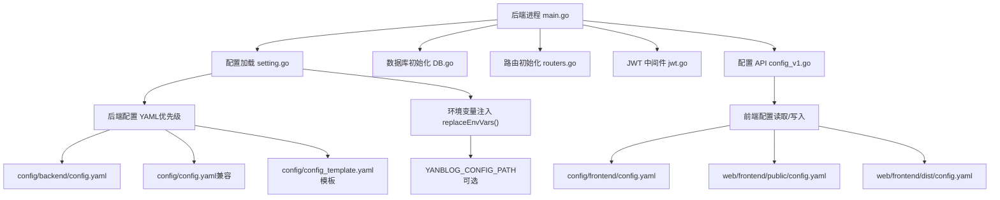
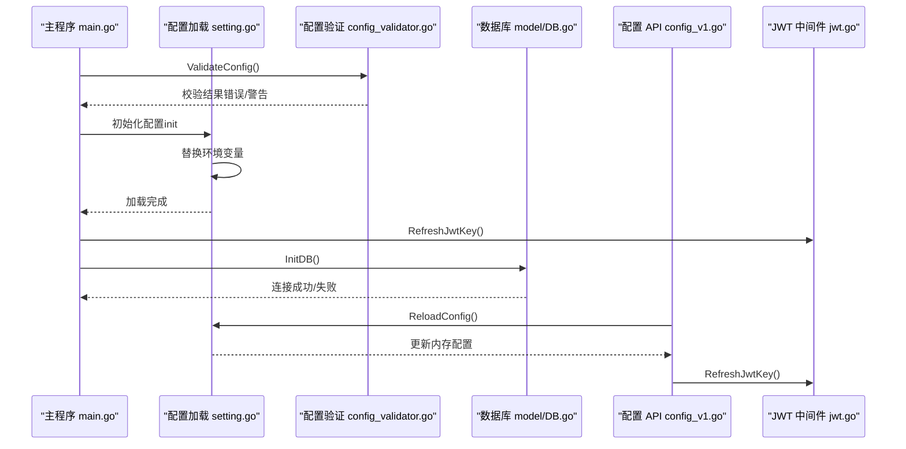
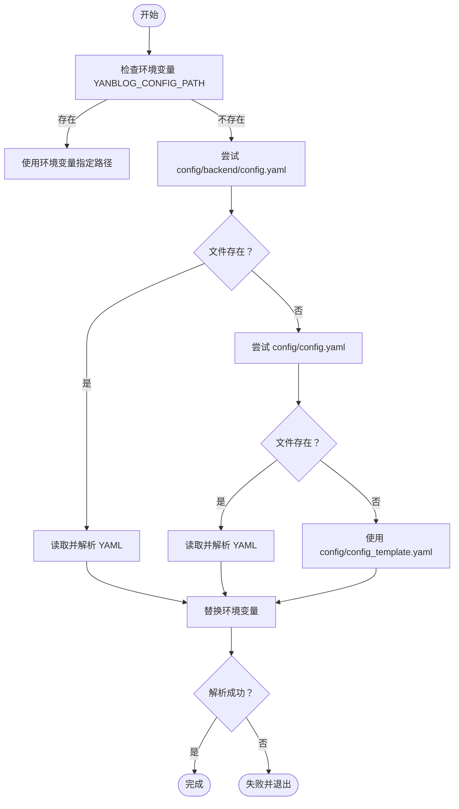
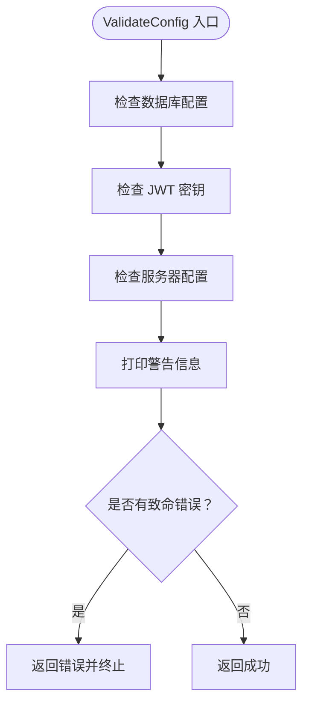
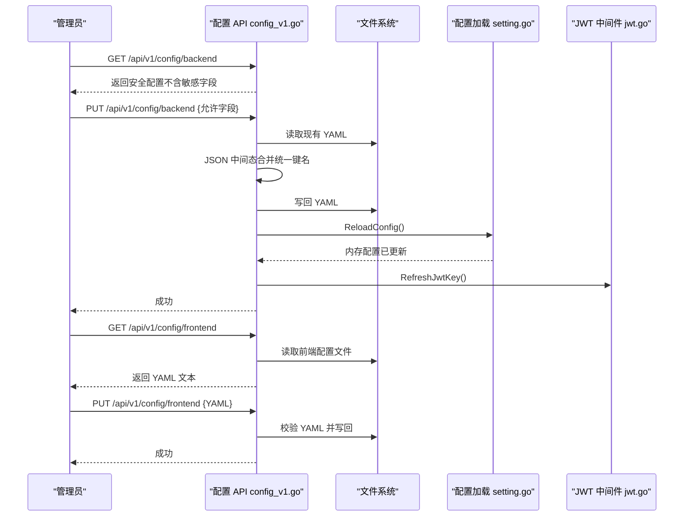
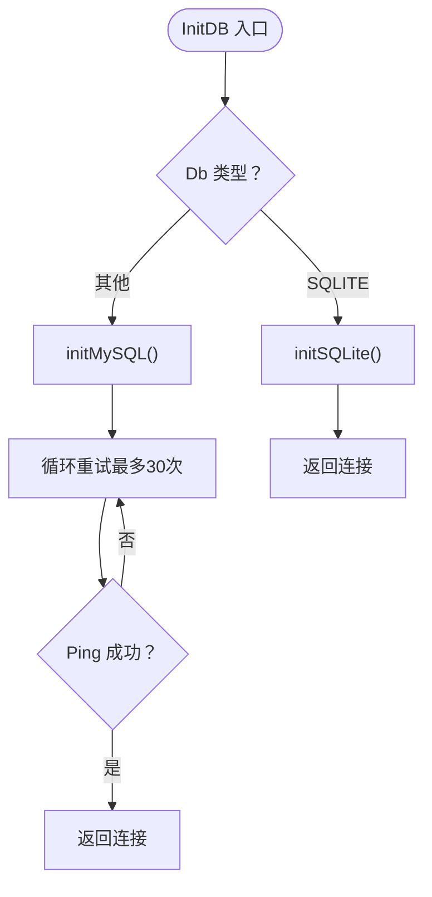
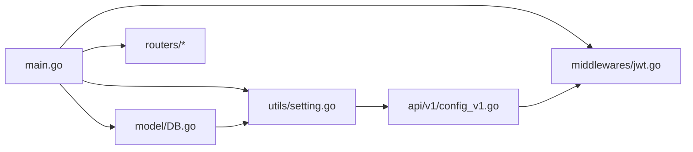

# 配置管理

<cite>
**本文引用的文件列表**
- [config_template.yaml](file://config/config_template.yaml)
- [config.yaml（后端）](file://config/config.yaml)
- [config.yaml（前端）](file://config/frontend/config.yaml)
- [config.yaml（前端发布版）](file://web/frontend/dist/config.yaml)
- [config.yaml（前端公共目录）](file://web/frontend/public/config.yaml)
- [setting.go](file://utils/setting.go)
- [config_validator.go](file://utils/config_validator.go)
- [config_v1.go](file://api/v1/config_v1.go)
- [jwt.go](file://middlewares/jwt.go)
- [DB.go](file://model/DB.go)
- [main.go](file://main.go)
- [docker-compose.yaml](file://docker-compose.yaml)
</cite>

## 目录
1. [简介](#简介)
2. [项目结构与配置层次](#项目结构与配置层次)
3. [核心组件](#核心组件)
4. [架构总览](#架构总览)
5. [详细组件分析](#详细组件分析)
6. [依赖关系分析](#依赖关系分析)
7. [性能与可用性考量](#性能与可用性考量)
8. [故障排查指南](#故障排查指南)
9. [结论](#结论)
10. [附录](#附录)

## 简介
本文件面向运维与开发者，系统性阐述 YanBlog 的配置管理体系，涵盖：
- 配置文件的层次结构与加载机制
- 后端配置项的含义与设置方法（数据库、JWT 密钥、天气、前端配置路径等）
- 前端配置文件的结构与用途
- 配置验证机制与错误处理流程
- 环境变量注入与动态配置热重载
- 安全考虑与最佳实践
- 配置继承与覆盖规则

## 项目结构与配置层次
YanBlog 的配置分为两类：
- 后端配置：位于后端工程内，控制服务运行、数据库连接、JWT 密钥、天气等
- 前端配置：位于前端工程内，控制站点外观、社交链接、评论等

配置文件的典型位置与优先级如下：
- 后端配置
  - 默认路径：config/backend/config.yaml
  - 兼容旧路径：config/config.yaml
  - 模板路径：config/config_template.yaml
  - 环境变量覆盖：可通过 YANBLOG_CONFIG_PATH 指定绝对路径
- 前端配置
  - 默认路径：config/frontend/config.yaml
  - 发布产物：web/frontend/dist/config.yaml
  - 开发资源：web/frontend/public/config.yaml

图表来源
- [main.go:12-31](file://main.go#L12-L31)
- [setting.go:47-64](file://utils/setting.go#L47-L64)
- [setting.go:77-98](file://utils/setting.go#L77-L98)
- [setting.go:100-117](file://utils/setting.go#L100-L117)
- [setting.go:159-171](file://utils/setting.go#L159-L171)
- [config_v1.go:16-38](file://api/v1/config_v1.go#L16-L38)
- [config_v1.go:40-77](file://api/v1/config_v1.go#L40-L77)
- [DB.go:26-79](file://model/DB.go#L26-L79)
- [jwt.go:15-20](file://middlewares/jwt.go#L15-L20)

章节来源
- [config/config_template.yaml:1-29](file://config/config_template.yaml#L1-L29)
- [config/frontend/config.yaml:1-124](file://config/frontend/config.yaml#L1-L124)
- [web/frontend/public/config.yaml:1-123](file://web/frontend/public/config.yaml#L1-L123)
- [web/frontend/dist/config.yaml](file://web/frontend/dist/config.yaml)
- [utils/setting.go:47-64](file://utils/setting.go#L47-L64)
- [utils/setting.go:159-171](file://utils/setting.go#L159-L171)

## 核心组件
- 配置模型与加载
  - 定义统一的 Config 结构体，支持 YAML 解析与并发安全访问
  - 支持环境变量替换与多路径自动发现
- 配置验证
  - 启动时进行关键字段校验，对敏感项给出警告
  - 对空 JWT 密钥生成临时密钥并提示尽快设置正式密钥
- 配置 API
  - 提供后端配置读取/更新/重载
  - 提供前端配置读取/更新
- JWT 密钥热刷新
  - 配置重载后刷新中间件使用的密钥
- 数据库初始化
  - 依据后端配置选择 SQLite 或 MySQL 并建立连接

章节来源
- [utils/setting.go:14-42](file://utils/setting.go#L14-L42)
- [utils/setting.go:77-98](file://utils/setting.go#L77-L98)
- [utils/config_validator.go:11-54](file://utils/config_validator.go#L11-L54)
- [api/v1/config_v1.go:79-107](file://api/v1/config_v1.go#L79-L107)
- [api/v1/config_v1.go:109-218](file://api/v1/config_v1.go#L109-L218)
- [middlewares/jwt.go:15-20](file://middlewares/jwt.go#L15-L20)
- [model/DB.go:26-79](file://model/DB.go#L26-L79)

## 架构总览
下图展示配置在系统中的流转与交互：

图表来源
- [main.go:12-31](file://main.go#L12-L31)
- [utils/config_validator.go:11-54](file://utils/config_validator.go#L11-L54)
- [utils/setting.go:47-64](file://utils/setting.go#L47-L64)
- [utils/setting.go:132-148](file://utils/setting.go#L132-L148)
- [model/DB.go:26-79](file://model/DB.go#L26-L79)
- [api/v1/config_v1.go:220-237](file://api/v1/config_v1.go#L220-L237)
- [middlewares/jwt.go:15-20](file://middlewares/jwt.go#L15-L20)

## 详细组件分析

### 后端配置模型与加载机制
- 结构体定义
  - server：运行模式、HTTP 端口、站点 URL
  - database：数据库类型、主机、端口、用户、密码、库名
  - JwtKey：JWT 密钥
  - weather：默认城市
  - FrontEndConfigPath：前端配置文件路径
  - cities：城市列表（扩展字段）
- 加载流程
  - 自动发现顺序：config/backend/config.yaml → config/config.yaml → config/config_template.yaml
  - 支持环境变量注入：YANBLOG_CONFIG_PATH 可强制指定配置文件路径
  - YAML 解析前先进行环境变量替换，支持 ${VAR} 与 ${VAR:default}
  - 并发安全：全局配置通过互斥锁保护，提供读写分离
- 保存与重载
  - SaveConfig：将内存配置写回 YAML 文件
  - ReloadConfig：重新读取文件并刷新内存；同时触发 JWT 密钥刷新

图表来源
- [utils/setting.go:47-64](file://utils/setting.go#L47-L64)
- [utils/setting.go:77-98](file://utils/setting.go#L77-L98)
- [utils/setting.go:100-117](file://utils/setting.go#L100-L117)

章节来源
- [utils/setting.go:14-42](file://utils/setting.go#L14-L42)
- [utils/setting.go:47-64](file://utils/setting.go#L47-L64)
- [utils/setting.go:77-98](file://utils/setting.go#L77-L98)
- [utils/setting.go:100-117](file://utils/setting.go#L100-L117)
- [utils/setting.go:119-130](file://utils/setting.go#L119-L130)
- [utils/setting.go:132-148](file://utils/setting.go#L132-L148)

### 配置验证与错误处理
- 验证内容
  - 数据库：用户名、库名必填；默认密码给出警告
  - JWT：空密钥生成临时密钥并提示尽快设置正式密钥；短密钥给出警告
  - 服务器：端口必填
- 错误处理
  - 验证失败会阻断启动，输出汇总错误信息
  - 警告信息在启动时打印，不影响运行
- 启动信息
  - 打印运行模式、端口、数据库类型与地址、天气配置状态

图表来源
- [utils/config_validator.go:11-54](file://utils/config_validator.go#L11-L54)
- [utils/config_validator.go:56-84](file://utils/config_validator.go#L56-L84)

章节来源
- [utils/config_validator.go:11-54](file://utils/config_validator.go#L11-L54)
- [utils/config_validator.go:56-84](file://utils/config_validator.go#L56-L84)

### 配置 API（后端/前端）
- 后端配置
  - 读取：过滤敏感字段（如 DbPassWord、JwtKey）后返回
  - 更新：仅允许白名单字段；禁止修改数据库密码；通过 JSON 中间态统一键名后再写回 YAML
  - 重载：重新加载配置并刷新 JWT 密钥
- 前端配置
  - 读取：根据 FrontEndConfigPath 获取前端配置文件路径并返回其 YAML 文本
  - 更新：校验 YAML 格式后写回原路径

图表来源
- [api/v1/config_v1.go:79-107](file://api/v1/config_v1.go#L79-L107)
- [api/v1/config_v1.go:109-218](file://api/v1/config_v1.go#L109-L218)
- [api/v1/config_v1.go:16-38](file://api/v1/config_v1.go#L16-L38)
- [api/v1/config_v1.go:40-77](file://api/v1/config_v1.go#L40-L77)
- [utils/setting.go:132-148](file://utils/setting.go#L132-L148)
- [middlewares/jwt.go:15-20](file://middlewares/jwt.go#L15-L20)

章节来源
- [api/v1/config_v1.go:79-107](file://api/v1/config_v1.go#L79-L107)
- [api/v1/config_v1.go:109-218](file://api/v1/config_v1.go#L109-L218)
- [api/v1/config_v1.go:16-38](file://api/v1/config_v1.go#L16-L38)
- [api/v1/config_v1.go:40-77](file://api/v1/config_v1.go#L40-L77)

### 数据库连接与配置
- 连接策略
  - 若 Db 为 SQLite，则使用文件路径；若为空则默认 yanblog.db
  - 若 Db 为其他（默认 MYSQL），使用 DSN 连接 MySQL
- 连接重试
  - MySQL 连接最多重试 30 次，间隔 2 秒
- 连接池
  - 最大空闲连接 10，最大打开连接 100，连接最大生命周期 10 秒
- 首次运行
  - 若用户表为空，创建默认超级管理员账号并提示修改密码
  - 若文章表为空，从演示文章文件导入示例文章

图表来源
- [model/DB.go:26-79](file://model/DB.go#L26-L79)
- [model/DB.go:81-122](file://model/DB.go#L81-L122)
- [model/DB.go:124-159](file://model/DB.go#L124-L159)

章节来源
- [model/DB.go:26-79](file://model/DB.go#L26-L79)
- [model/DB.go:81-122](file://model/DB.go#L81-L122)
- [model/DB.go:124-159](file://model/DB.go#L124-L159)

### JWT 密钥与热重载
- 密钥来源
  - 从后端配置读取 JwtKey
  - 启动时若为空，生成临时密钥并刷新中间件
- 热重载
  - 后端配置更新后，调用 RefreshJwtKey 刷新中间件使用的密钥
  - 前端配置更新不会影响 JWT 密钥

章节来源
- [middlewares/jwt.go:15-20](file://middlewares/jwt.go#L15-L20)
- [api/v1/config_v1.go:210-212](file://api/v1/config_v1.go#L210-L212)

## 依赖关系分析
- 组件耦合
  - main.go 依赖配置验证、JWT 刷新、数据库初始化与路由初始化
  - 配置 API 依赖配置加载模块与 JWT 中间件
  - 数据库初始化依赖配置加载模块
- 外部依赖
  - YAML 解析：gopkg.in/yaml.v3
  - 数据库驱动：gorm.io/driver/mysql、gorm.io/driver/sqlite
  - JWT：github.com/golang-jwt/jwt/v5
- 潜在风险
  - 配置文件路径变更需同步更新 FrontEndConfigPath
  - 环境变量注入可能导致意外覆盖，应谨慎使用

图表来源
- [main.go:12-31](file://main.go#L12-L31)
- [utils/setting.go:47-64](file://utils/setting.go#L47-L64)
- [model/DB.go:26-79](file://model/DB.go#L26-L79)
- [api/v1/config_v1.go:79-107](file://api/v1/config_v1.go#L79-L107)
- [middlewares/jwt.go:15-20](file://middlewares/jwt.go#L15-L20)

章节来源
- [main.go:12-31](file://main.go#L12-L31)
- [utils/setting.go:47-64](file://utils/setting.go#L47-L64)
- [model/DB.go:26-79](file://model/DB.go#L26-L79)
- [api/v1/config_v1.go:79-107](file://api/v1/config_v1.go#L79-L107)
- [middlewares/jwt.go:15-20](file://middlewares/jwt.go#L15-L20)

## 性能与可用性考量
- 配置加载
  - YAML 解析与环境变量替换在启动阶段一次性完成，运行时通过只读快照访问，避免频繁 IO
- 数据库连接
  - 连接池参数适中，适合中小型站点；高并发场景可按需调整
- 热重载
  - ReloadConfig 仅在后台配置更新时触发，前端配置更新不涉及数据库或 JWT，开销较小
- 缓存控制
  - 前端配置读取接口禁用缓存，确保修改后立即生效

[本节为通用指导，无需列出具体文件来源]

## 故障排查指南
- 启动失败（配置错误）
  - 症状：启动时报错并退出
  - 排查：检查数据库用户名/密码/库名、JWT 密钥、服务器端口是否填写完整
  - 参考：配置验证逻辑与启动信息打印
- JWT 登录失败
  - 症状：登录后无法访问受保护接口
  - 排查：确认后端配置中 JwtKey 是否设置；若曾热重载，确认中间件已刷新密钥
- 数据库连接失败
  - 症状：启动时报数据库连接错误
  - 排查：确认数据库类型、主机、端口、用户、密码、库名；MySQL 需等待容器启动完成
- 前端配置未生效
  - 症状：站点外观未按预期变化
  - 排查：确认 FrontEndConfigPath 指向的文件路径正确；更新后接口返回成功但浏览器缓存导致未刷新，可强制刷新页面

章节来源
- [utils/config_validator.go:11-54](file://utils/config_validator.go#L11-L54)
- [utils/config_validator.go:56-84](file://utils/config_validator.go#L56-L84)
- [middlewares/jwt.go:15-20](file://middlewares/jwt.go#L15-L20)
- [model/DB.go:81-122](file://model/DB.go#L81-L122)
- [api/v1/config_v1.go:16-38](file://api/v1/config_v1.go#L16-L38)

## 结论
YanBlog 的配置管理以 YAML 为核心，结合环境变量注入与热重载机制，实现了灵活、安全、可观测的配置体系。后端通过严格的验证与启动信息输出保障运行安全，前端配置通过 API 实现可视化管理。建议在生产环境中：
- 明确配置文件路径与权限
- 使用环境变量进行差异化部署
- 定期轮换 JWT 密钥
- 通过配置 API 进行最小化变更与回滚

[本节为总结性内容，无需列出具体文件来源]

## 附录

### 后端配置项说明与设置方法
- server
  - AppMode：运行模式（如 debug）
  - HttpPort：监听端口（如 :8080）
  - SiteUrl：站点 URL（可选）
- database
  - Db：数据库类型（SQLite 或 MYSQL）
  - DbHost：数据库主机
  - DbPort：数据库端口
  - DbUser：数据库用户
  - DbPassWord：数据库密码（强烈建议修改默认值）
  - DbName：数据库名（SQLite 时为文件路径）
- JwtKey：JWT 密钥（必须设置，建议使用足够长度的随机值）
- weather
  - DefaultCity：默认城市（用于天气服务）
- FrontEndConfigPath：前端配置文件路径（可选）

设置步骤建议：
- 复制模板为 config/backend/config.yaml
- 修改数据库、JWT 密钥、端口等关键项
- 如需差异化部署，使用环境变量覆盖（YANBLOG_CONFIG_PATH）

章节来源
- [config/config_template.yaml:6-28](file://config/config_template.yaml#L6-L28)
- [utils/setting.go:14-42](file://utils/setting.go#L14-L42)

### 前端配置文件结构与用途
- 主要字段
  - 站点基本信息：blog_name、author_name、favicon、logo_text、logo_image
  - 页面标题：page_title.default、page_title.blur
  - 英雄区：hero.title、hero.subtitle、hero.welcome、hero.welcome_image
  - 默认图片：default_images.cover、default_images.avatar
  - 社交与联系：socials、contacts、related_links、portfolio
  - 页脚：footer.copyright、footer.icp、footer.powered_by
  - 快捷方式：shortcuts
  - 音乐播放器：music_player.show、music_player.url
  - 评论：comment.enable、comment.type、comment.giscus.*
- 用途
  - 控制站点外观与功能开关
  - 通过 API 可在线编辑并持久化

章节来源
- [config/frontend/config.yaml:1-124](file://config/frontend/config.yaml#L1-L124)
- [web/frontend/public/config.yaml:1-123](file://web/frontend/public/config.yaml#L1-L123)

### 环境变量配置与动态配置热重载
- 环境变量
  - YANBLOG_CONFIG_PATH：强制指定后端配置文件路径
  - YAML 中支持 ${VAR} 与 ${VAR:default} 形式的变量替换
- 动态热重载
  - 后端配置：PUT /api/v1/config/backend 后自动重载并刷新 JWT 密钥
  - 前端配置：PUT /api/v1/config/frontend 后立即生效（禁用缓存）

章节来源
- [utils/setting.go:70-75](file://utils/setting.go#L70-L75)
- [utils/setting.go:100-117](file://utils/setting.go#L100-L117)
- [api/v1/config_v1.go:220-237](file://api/v1/config_v1.go#L220-L237)
- [api/v1/config_v1.go:40-77](file://api/v1/config_v1.go#L40-L77)

### 配置继承与覆盖规则
- 路径优先级（后端）
  - config/backend/config.yaml > config/config.yaml > config/config_template.yaml
- 环境变量覆盖
  - YANBLOG_CONFIG_PATH 可强制指定绝对路径
  - YAML 中的 ${VAR[:default]} 支持变量替换与默认值
- 字段覆盖
  - 后端配置更新通过 JSON 中间态统一键名再写回 YAML，确保键名一致性

章节来源
- [utils/setting.go:47-64](file://utils/setting.go#L47-L64)
- [utils/setting.go:70-75](file://utils/setting.go#L70-L75)
- [utils/setting.go:100-117](file://utils/setting.go#L100-L117)
- [api/v1/config_v1.go:163-187](file://api/v1/config_v1.go#L163-L187)

### 安全考虑与最佳实践
- 密钥与密码
  - JWT 密钥必须设置，长度建议足够长；避免使用默认值
  - 数据库密码务必修改为强密码
- 权限与隔离
  - 配置文件与数据目录在容器中持久化挂载，注意文件权限
  - 建议将敏感配置放入只读卷或外部密钥管理
- 最小暴露
  - 后端配置 API 返回时过滤敏感字段（如 DbPassWord、JwtKey）
- 变更审计
  - 通过配置 API 进行变更，保留操作痕迹
- 生产部署
  - 使用环境变量进行差异化部署
  - 前端配置更新后立即生效，建议在维护窗口进行

章节来源
- [utils/config_validator.go:17-36](file://utils/config_validator.go#L17-L36)
- [api/v1/config_v1.go:82-100](file://api/v1/config_v1.go#L82-L100)
- [docker-compose.yaml:6-12](file://docker-compose.yaml#L6-L12)