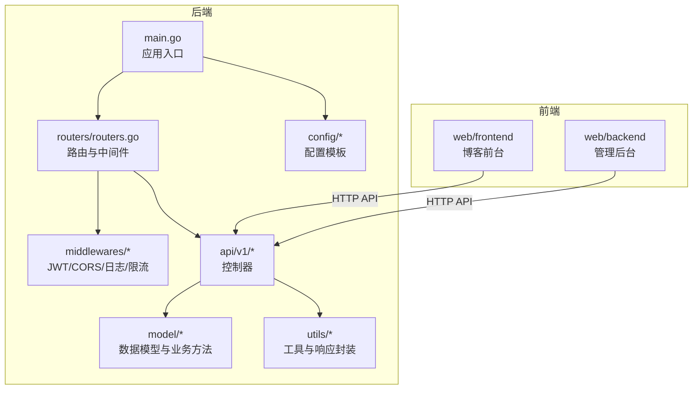
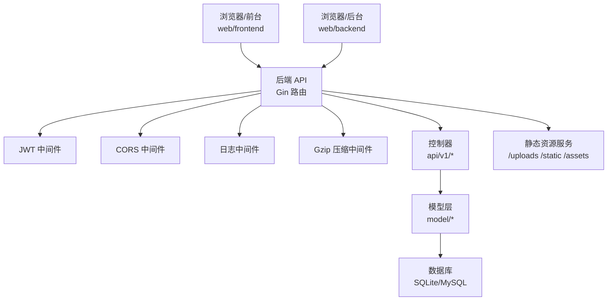
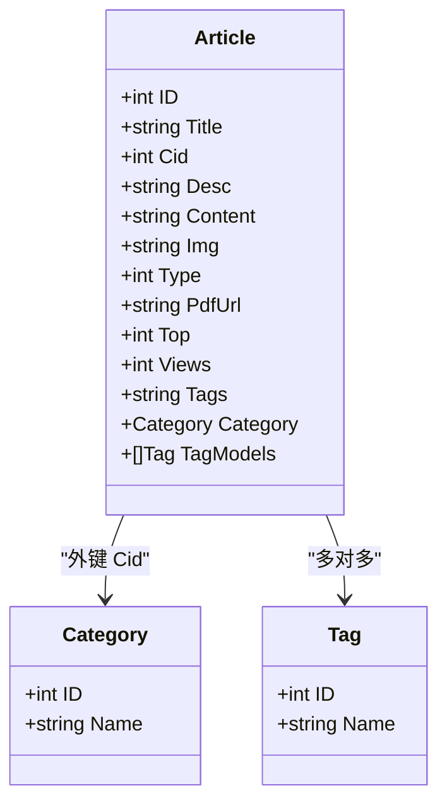
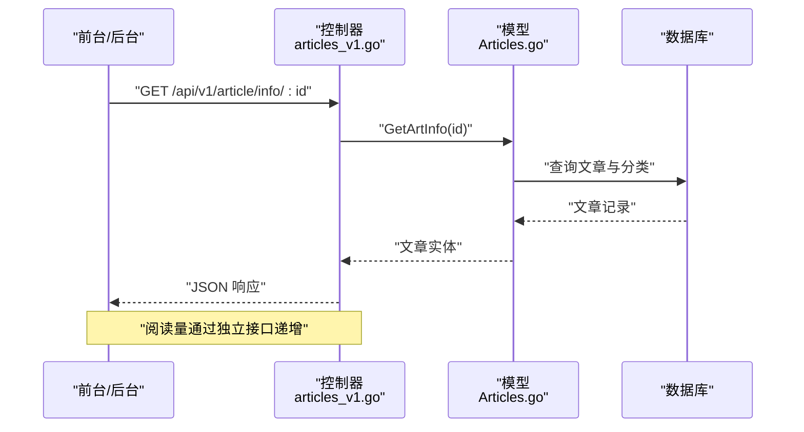
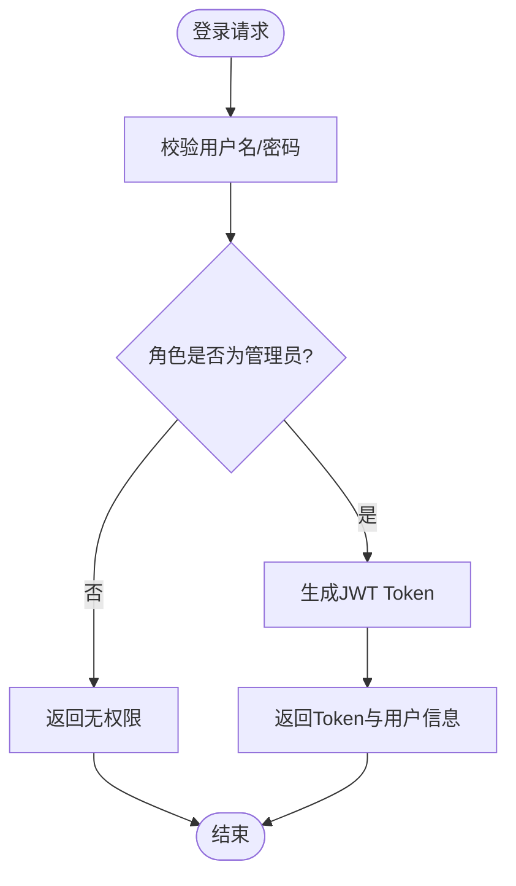
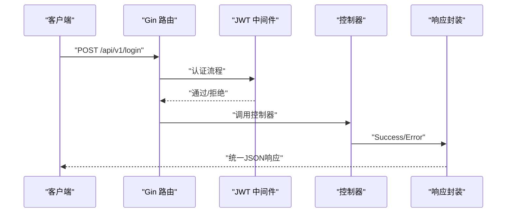
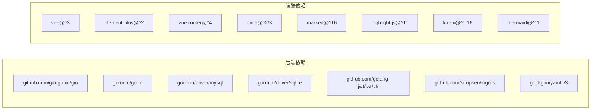

# 项目概述

<cite>
**本文引用的文件**
- [README.md](file://README.md)
- [main.go](file://main.go)
- [routers.go](file://routers/routers.go)
- [Articles.go](file://model/Articles.go)
- [Users.go](file://model/Users.go)
- [articles_v1.go](file://api/v1/articles_v1.go)
- [users_v1.go](file://api/v1/users_v1.go)
- [jwt.go](file://middlewares/jwt.go)
- [response.go](file://utils/response.go)
- [config_template.yaml](file://config/config_template.yaml)
- [package.json (前端)](file://web/frontend/package.json)
- [package.json (后台)](file://web/backend/package.json)
- [main.ts (前端)](file://web/frontend/src/main.ts)
- [main.ts (后台)](file://web/backend/src/main.ts)
- [go.mod](file://go.mod)
</cite>

## 目录
1. [简介](#简介)
2. [项目结构](#项目结构)
3. [核心组件](#核心组件)
4. [架构总览](#架构总览)
5. [详细组件分析](#详细组件分析)
6. [依赖分析](#依赖分析)
7. [性能考虑](#性能考虑)
8. [故障排查指南](#故障排查指南)
9. [结论](#结论)
10. [附录](#附录)

## 简介
YanBlog 是一个基于 Go + Vue 3 的现代化博客系统，采用前后端分离架构设计。后端使用 Gin + GORM 提供 RESTful API，前端分别提供博客前台与管理后台两套独立应用，均基于 Vue 3 + TypeScript + Vite 构建。系统支持 Markdown 编辑、暗黑模式、代码高亮、标签与分类管理、文件上传与批量操作、用户权限体系、SEO 站点地图等功能，并提供 Docker 一键部署能力。

本项目旨在为个人用户提供开箱即用的博客平台，同时为开发者提供清晰的模块划分、完善的权限控制与可扩展的配置体系，便于二次开发与定制。

## 项目结构
项目采用“后端 API + 前端前台 + 前端后台”的三层结构组织，配合中间件、工具库与配置模块，形成清晰的职责边界：

- 后端入口与初始化：main.go 负责配置校验、JWT 密钥刷新、数据库初始化与路由注册
- 路由与中间件：routers/routers.go 定义 API 分组与静态资源服务，middlewares 提供 JWT/CORS/日志/限流等横切能力
- 数据模型与业务：model 下的 Articles、Users 等模型定义数据结构与核心业务方法
- API 控制器：api/v1 下按功能域拆分控制器，如文章、用户、文件、配置等
- 前端应用：web/frontend 为博客前台，web/backend 为管理后台，各自独立构建与部署
- 配置与工具：config 提供后端配置模板，utils 提供统一响应、分页解析、错误码等通用能力

图表来源
- [main.go:12-31](file://main.go#L12-L31)
- [routers.go:13-122](file://routers/routers.go#L13-L122)
- [jwt.go:98-157](file://middlewares/jwt.go#L98-L157)
- [articles_v1.go:18-273](file://api/v1/articles_v1.go#L18-L273)
- [users_v1.go:15-283](file://api/v1/users_v1.go#L15-L283)

章节来源
- [README.md:58-74](file://README.md#L58-L74)
- [main.go:12-31](file://main.go#L12-L31)
- [routers.go:13-122](file://routers/routers.go#L13-L122)

## 核心组件
- 后端框架与 ORM
  - Gin：高性能 HTTP 框架，提供路由、中间件与上下文处理
  - GORM：对象关系映射，支持 SQLite/MySQL，提供模型定义与查询方法
- 认证与授权
  - JWT：基于 HS256 签名，10 小时有效期，支持管理员权限中间件
- 前端技术栈
  - Vue 3 + TypeScript + Vite：前台与后台双应用，Element Plus UI 组件库
  - Marked + KaTeX + Mermaid + highlight.js：Markdown 渲染与代码高亮
- 配置与部署
  - YAML 配置模板，支持 SQLite（开发）与 MySQL（生产），Docker Compose 一键部署

章节来源
- [README.md:36-56](file://README.md#L36-L56)
- [go.mod:5-19](file://go.mod#L5-L19)
- [jwt.go:22-49](file://middlewares/jwt.go#L22-L49)
- [package.json (前端):16-30](file://web/frontend/package.json#L16-L30)
- [package.json (后台):20-35](file://web/backend/package.json#L20-L35)

## 架构总览
系统采用典型的前后端分离架构：前端通过 HTTP API 与后端交互，后端提供 RESTful 接口并负责数据持久化与业务逻辑。JWT 用于认证，CORS/Gzip/日志/限流等中间件保障安全与性能。静态资源（上传文件、前端静态资源）由后端统一提供。

图表来源
- [routers.go:13-122](file://routers/routers.go#L13-L122)
- [jwt.go:98-157](file://middlewares/jwt.go#L98-L157)
- [Articles.go:51-106](file://model/Articles.go#L51-L106)
- [Users.go:110-147](file://model/Users.go#L110-L147)

## 详细组件分析

### 文章系统（模型与控制器）
- 模型特性
  - 支持 Markdown/PDF 两种内容类型
  - 标签多对多关联，支持置顶、阅读量、归档、相关文章推荐等
  - 针对不同数据库提供兼容的日期格式化与随机查询
- 控制器能力
  - 文章 CRUD、置顶/热门/随机/相邻文章、归档、搜索、批量删除
  - 标题变更时自动迁移上传目录并替换内容中的引用路径

图表来源
- [Articles.go:11-25](file://model/Articles.go#L11-L25)

图表来源
- [articles_v1.go:78-89](file://api/v1/articles_v1.go#L78-L89)
- [Articles.go:133-143](file://model/Articles.go#L133-L143)

章节来源
- [Articles.go:51-106](file://model/Articles.go#L51-L106)
- [Articles.go:180-227](file://model/Articles.go#L180-L227)
- [Articles.go:248-271](file://model/Articles.go#L248-L271)
- [articles_v1.go:18-273](file://api/v1/articles_v1.go#L18-L273)

### 用户系统（模型与控制器）
- 模型特性
  - 用户名唯一，角色码区分超级管理员、管理员、普通用户
  - 登录密码使用 bcrypt 加密，GORM 钩子在保存前自动加密
  - 权限过滤：根据当前用户角色限制可见范围
- 控制器能力
  - 用户增删改查、搜索、登录（JWT）、权限校验（管理员中间件）

图表来源
- [Users.go:214-237](file://model/Users.go#L214-L237)
- [jwt.go:30-49](file://middlewares/jwt.go#L30-L49)

章节来源
- [Users.go:11-18](file://model/Users.go#L11-L18)
- [Users.go:189-212](file://model/Users.go#L189-L212)
- [Users.go:214-237](file://model/Users.go#L214-L237)
- [users_v1.go:15-283](file://api/v1/users_v1.go#L15-L283)

### 路由与中间件
- 路由分组
  - 公共接口：文章、分类、标签、天气、健康检查、站点地图等
  - 需认证接口：用户列表、文件管理、前端配置更新等
  - 管理员接口：新增/编辑/删除用户、文章、标签、文件目录操作、后端配置管理等
- 中间件
  - 日志、恢复、Gzip 压缩、CORS、JWT 认证、管理员权限、登录频率限制

图表来源
- [routers.go:94-122](file://routers/routers.go#L94-L122)
- [jwt.go:98-157](file://middlewares/jwt.go#L98-L157)
- [response.go:19-64](file://utils/response.go#L19-L64)

章节来源
- [routers.go:13-122](file://routers/routers.go#L13-L122)
- [jwt.go:15-157](file://middlewares/jwt.go#L15-L157)
- [response.go:17-100](file://utils/response.go#L17-L100)

### 配置与部署
- 配置文件
  - 后端配置模板：server、database、JwtKey、weather、FrontEndConfigPath
  - 首次运行自动加载模板，可通过 config/backend/config.yaml 覆盖
- 部署方式
  - Docker Compose 一键启动，支持前台（:3002）、后台（:3011）与后端（:8080）端口映射
  - 本地开发：后端 go run main.go，前台/后台分别 npm run dev

章节来源
- [config_template.yaml:6-29](file://config/config_template.yaml#L6-L29)
- [README.md:7-34](file://README.md#L7-L34)

## 依赖分析
- 后端依赖
  - Gin 生态：Gzip、CORS、SSE 等中间件
  - GORM 与驱动：sqlite/mysql
  - JWT：golang-jwt/jwt/v5
  - 日志与工具：logrus、file-rotatelogs、validator/v10、yaml.v3 等
- 前端依赖
  - Vue 3 + Element Plus + Vue Router + Pinia
  - Marked/KaTeX/Mermaid/highlight.js 用于渲染与美化
  - Vite 构建工具链与 TypeScript 类型支持

图表来源
- [go.mod:5-19](file://go.mod#L5-L19)
- [package.json (前端):16-30](file://web/frontend/package.json#L16-L30)
- [package.json (后台):20-35](file://web/backend/package.json#L20-L35)

章节来源
- [go.mod:1-72](file://go.mod#L1-L72)
- [package.json (前端):1-45](file://web/frontend/package.json#L1-L45)
- [package.json (后台):1-62](file://web/backend/package.json#L1-L62)

## 性能考虑
- 分页与查询优化
  - 文章列表与用户列表均先查总数再分页，避免一次性加载大量数据
  - 搜索接口支持关键词与分类筛选，合理使用索引与 LIKE 优化
- 数据库兼容
  - 针对 SQLite 与 MySQL 的日期格式化与随机函数差异进行适配
- 压缩与缓存
  - 启用 Gzip 压缩减少传输体积
  - 静态资源（头像、图片、上传文件）由后端统一提供，利于 CDN 与缓存策略
- 安全与稳定性
  - JWT 10 小时有效期，超时自动失效
  - 登录频率限制与管理员权限中间件降低暴力破解与越权风险
  - 统一响应封装与错误码，便于前端统一处理

## 故障排查指南
- 配置问题
  - 若启动时报配置错误，请检查 config/backend/config.yaml 是否存在且包含 JwtKey、数据库连接等必要字段
- 认证失败
  - 确认 Authorization 请求头格式为 Bearer Token，且未过期
  - 管理员接口报无权限时，确认当前用户角色是否为超级管理员或管理员
- 数据库连接
  - SQLite 默认无需额外配置；若使用 MySQL，请确保主机、端口、用户名、密码与库名正确
- 文件上传
  - 确认 uploads 目录存在且具备写权限；批量上传大小限制为 200MB
- 前端访问
  - 前台地址：http://localhost:3002；后台地址：http://localhost:3011；默认账号 admin/123456

章节来源
- [main.go:14-18](file://main.go#L14-L18)
- [jwt.go:100-157](file://middlewares/jwt.go#L100-L157)
- [routers.go:26-36](file://routers/routers.go#L26-L36)
- [README.md:18-21](file://README.md#L18-L21)

## 结论
YanBlog 以清晰的模块划分与前后端分离架构，提供了从内容创作到系统管理的完整能力。后端基于 Gin + GORM，具备良好的扩展性；前端采用 Vue 3 生态，兼顾易用与性能。结合 JWT 权限控制、统一响应封装与 Docker 一键部署，既适合初学者快速上手，也为进阶开发者提供了稳定的开发基座。

## 附录
- 快速开始
  - Docker 部署：准备配置文件并执行 docker compose up -d --build
  - 本地开发：后端 go run main.go，前台/后台分别 npm run dev
- 功能清单
  - 文章系统：Markdown 编辑、分类/标签、置顶、阅读量、ZIP 批量上传
  - 暗黑模式、代码块美化、全配置化、文件管理、用户权限、SEO、响应式

章节来源
- [README.md:5-34](file://README.md#L5-L34)
- [README.md:47-56](file://README.md#L47-L56)