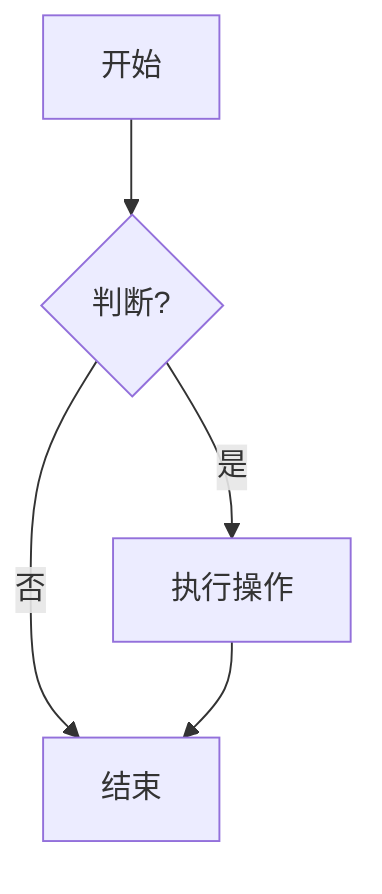
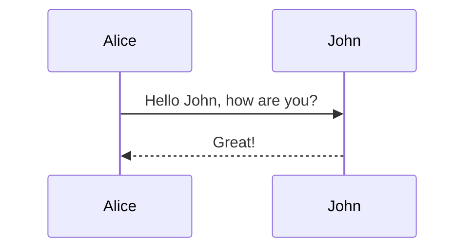

# H1 总标题 - Markdown 语法测试

这是一份仅用于测试 Markdown 渲染效果的示例文档。本文档尽可能涵盖了标准 Markdown 以及 GFM (GitHub Flavored Markdown) 的各种常见语法。

[TOC]

## 1. 文本排版 (Typography)

### 1.1 标题 (Headers)

# H1 一级标题
## H2 二级标题
### H3 三级标题
#### H4 四级标题
##### H5 五级标题
###### H6 六级标题

### 1.2 强调与修饰 (Emphasis)

*   **加粗文本 (Bold)** 或 __加粗文本__
*   *斜体文本 (Italic)* 或 _斜体文本_
*   ***粗斜体文本*** 或 ___粗斜体文本___
*   ~~删除线文本 (Strikethrough)~~
*   `行内代码 (Inline Code)`
*   <u>下划线 (Underline - HTML)</u>
*   <kbd>Ctrl</kbd> + <kbd>C</kbd> (键盘样式 - HTML)

### 1.3 上标与下标 (Super/Subscript)

*   H<sub>2</sub>O (下标)
*   X<sup>2</sup> (上标)

---

## 2. 列表 (Lists)

### 2.1 无序列表

* 项目一
* 项目二
  * 子项目 A
  * 子项目 B
    * 三级嵌套项目
* 项目三

### 2.2 有序列表

1. 第一步
2. 第二步
3. 第三步
   1. 子步骤 3.1
   2. 子步骤 3.2

### 2.3 任务列表 (Task Lists)

- [x] 已完成任务
- [ ] 待办任务 A
- [ ] 待办任务 B
  - [x] 子任务（已完成）
  - [ ] 子任务（未完成）

---

## 3. 引用 (Blockquotes)

> 这是一个一级引用段落。
> 
> > 这是一个嵌套的二级引用。
> > > 三级引用可以继续嵌套。
> 
> 回到一级引用。

**引用中包含代码：**

> 这是一个包含代码块的引用：
> 
> ```python
> print("Hello Blockquote")
> ```

---

## 4. 代码块 (Code Blocks)

### 4.1 普通代码块

    // 这是一个缩进风格的代码块（4个空格）
    function test() {
      console.log("Hello");
    }

### 4.2 语法高亮 (Syntax Highlighting)

#### Go
```go
package main

import "fmt"

func main() {
    ch := make(chan string)
    go func() {
        ch <- "Hello, Markdown!"
    }()
    msg := <-ch
    fmt.Println(msg)
}
```

#### Python
```python
def fibonacci(n):
    if n <= 0:
        return []
    elif n == 1:
        return [0]
    
    sequence = [0, 1]
    while len(sequence) < n:
        sequence.append(sequence[-1] + sequence[-2])
    return sequence

print(fibonacci(10))
```

#### JavaScript / TypeScript
```typescript
interface User {
  id: number;
  name: string;
}

const getUser = (id: number): User => {
  return { id, name: "Alice" };
};
```

#### JSON
```json
{
  "project": "YanBlog",
  "version": "1.0.0",
  "features": ["Vue3", "Go", "Markdown"]
}
```

#### Diff (Git Patch)
```diff
- var old = "Old Value";
+ var new = "New Value";
  var common = "Common";
```

---

## 5. 链接与图片 (Links & Images)

### 5.1 链接

*   [普通链接 (Google)](https://www.google.com)
*   [带标题的链接](https://github.com "GitHub Homepage")
*   自动链接: https://www.example.com
*   邮箱链接: <contact@example.com>
*   引用式链接: [百度][1]

[1]: https://www.baidu.com "引用式链接跳转"

### 5.2 图片

**行内图片：**


**带链接的图片：**
[](https://www.google.com)

---

## 6. 表格 (Tables)

| 默认对齐 | 左对齐 | 右对齐 | 居中对齐 |
| --- | :--- | ---: | :---: |
| 单元格 1 | 文本内容 | 100 | ✅ |
| 单元格 2 | 长文本测试长文本测试 | $200 | ❌ |
| 单元格 3 | Short | 3.14159 | ⚠️ |

---

## 7. 数学公式 (Mathematical Formulas)

如果渲染器支持 LaTeX (如 KaTeX 或 MathJax)。

**行内公式：**
质能方程是 $E=mc^2$。

**块级公式：**

$$
\sum_{i=1}^{n} i = \frac{n(n+1)}{2}
$$

$$
f(x) = \int_{-\infty}^\infty \hat f(\xi)\,e^{2\pi i \xi x} \,d\xi
$$

矩阵示例：
$$
\begin{pmatrix}
1 & a_1 & a_1^2 & \cdots & a_1^n \\
1 & a_2 & a_2^2 & \cdots & a_2^n \\
\vdots & \vdots & \vdots & \ddots & \vdots \\
1 & a_m & a_m^2 & \cdots & a_m^n
\end{pmatrix}
$$

---

## 8. HTML 元素支持

如果 Markdown 允许嵌入 HTML：

<details>
<summary>点击展开详情 (Details/Summary)</summary>
<br>
这里是折叠的内容。你可以在这里放更多的文字、图片甚至代码。

```js
console.log("Hidden Code");
```
</details>

<br>
<div style="padding: 15px; border: 1px solid #ddd; background-color: #f9f9f9; border-radius: 4px;">
    这是一个带有内联样式的 <code>div</code> 盒子。
</div>

---

## 9. 特殊符号与脚注

### 9.1 Emoji 表情
:smile: :rocket: :tada: :warning: :memo:

### 9.2 脚注 (Footnotes)
这里有一个脚注引用[^1]，这里有另一个[^longnote]。

[^1]: 这是第一个脚注的定义。
[^longnote]: 这是第二个脚注，通常用于解释更长的内容或者参考文献。

---

## 10. 目前仅作为文本展示的扩展语法 (Mermaid 等)

如果支持 Mermaid 图表：





---

*文档末尾。*
