# Go+Vue 前后端分离博客系统

[原项目链接](https://github.com/wejectchen/Ginblog.git)

后端主要参考了 ginblog，由于原教程是 22 年的有一些东西不一样了，同时我也希望设计一些更丰富的功能。

## 项目简介

这是一个使用 Go 语言和 Vue.js 构建的前后端分离博客系统。后端采用 Gin 框架，前端使用 Vue 3 + TypeScript + Vite 构建。支持 Docker 一键部署。

## 技术栈

### 后端 (Go)

- **框架**: Gin
- **数据库**: MySQL
- **ORM**: GORM
- **中间件**: 日志记录、CORS、JWT 认证、GZIP 压缩
- **API 设计**: RESTful API

### 前端

- **前端框架**: Vue 3 + TypeScript + Vite
- **UI 组件库**: Element Plus
- **图表库**: ECharts
- **Markdown 渲染**: Marked、markdown-it、md-editor-v3
- **数学公式**: KaTeX
- **流程图**: Mermaid
- **状态管理**: Pinia

## 功能特性

### 后端功能

- 用户管理（注册、登录、权限控制）
- 文章管理（创建、编辑、删除、分类）
- 分类管理
- 标签系统（支持多对多关系）
- 文件上传及管理
- 天气信息获取
- 系统状态监控
- 站点地图生成
- JWT Token 认证
- 搜索功能（文章标题、描述、标签）
- 文章归档功能
- 相关文章推荐（基于标签匹配）

### 前台功能

- **全站暗黑模式适配**：支持跟随系统自动切换或手动切换，精心调教的配色，解决了加载闪烁问题。
- **文章归档与标签云**：github绿墙、时间轴样式的归档页面和侧边栏标签云，方便按时间和标签检索文章。
- **精致的 UI/UX**：
  - 加载动画与骨架屏优化，提升视觉体验。
  - 自定义滚动条样式。
  - 侧边栏卡片（天气、热门文章、服务器状态）视觉升级。
- 响应式设计，适配不同设备
- 文章列表展示与分类筛选
- 文章详情页面（支持目录、评论）
- 搜索功能
- **全配置化管理**：头像、背景图、Logo、二维码等均可通过配置文件修改，无需修改代码。

### 后台管理功能

- 仪表盘（数据统计和图表展示）
- 用户管理（增删改查）
- 文章管理（创建、编辑、删除、分类）
- 分类管理
- 标签管理
- 媒体库（文件上传、管理）
- 配置管理（前端配置）

## 项目结构

```
.
├── api
│   └── v1                    # API 接口
├── config                    # 配置文件
├── docker_field              # Docker 配置
│   ├── backend               # 后端 Docker 配置
│   └── frontend              # 前端 Docker 配置
├── middlewares               # 中间件
├── model                     # 数据模型
├── routers                   # 路由配置
├── utils                     # 工具函数
│   ├── errmsg                # 错误消息
│   └── validator             # 验证器
├── web                       # 前端代码
│   ├── backend               # 后台管理系统
│   └── frontend              # 前台展示系统
├── uploads                   # 上传文件存储
├── README.md
├── docker-compose.yaml
├── Dockerfile
├── init.sh                   # Linux 初始化脚本
├── init.ps1                  # Windows 初始化脚本
└── main.go                   # 项目入口
```

## 快速开始 (Docker 部署)

这是最推荐的部署方式，简单快捷。

### 1. 准备配置文件

在项目根目录下，你需要准备好配置文件。

将[docker_field](file:///c:/code_workbench/yanblog%20-%20%E5%89%AF%E6%9C%AC/docker_field)文件夹下的[docker_config.yaml](file:///c:/code_workbench/yanblog%20-%20%E5%89%AF%E6%9C%AC/docker_field/backend/docker_config.yaml)复制重命名为[config.yaml](file:///c:/code_workbench/yanblog%20-%20%E5%89%AF%E6%9C%AC/config/config.yaml)，记得填写好相关的信息（如果想自己本地运行，把[docker_field](file:///c:/code_workbench/yanblog%20-%20%E5%89%AF%E6%9C%AC/docker_field)文件夹下的[docker_config.yaml](file:///c:/code_workbench/yanblog%20-%20%E5%89%AF%E6%9C%AC/docker_field/backend/docker_config.yaml)复制重命名为[config.yaml](file:///c:/code_workbench/yanblog%20-%20%E5%89%AF%E6%9C%AC/config/config.yaml)放到/config下，还有一个放到/web/frontend/public/[config.yaml](file:///c:/code_workbench/yanblog%20-%20%E5%89%AF%E6%9C%AC/config/config.yaml)）

### 2. 启动服务

确保你已经安装了 Docker 和 Docker Compose，然后在项目根目录下运行：

```bash
docker-compose up --build -d
```

### 3. 访问服务

启动成功后，你可以通过以下地址访问：

- **博客前台**: [http://localhost:3002](http://localhost:3002)
- **后台管理**: [http://localhost:3001](http://localhost:3001)
- **后端 API**: [http://localhost:8080](http://localhost:8080)

### 4. 后续维护

- **修改前端配置**：直接编辑 `docker_field/frontend/config.yaml`，保存后刷新浏览器即可生效。
- **修改关于页面**：直接编辑 `docker_field/frontend/static/about.md`，支持 Markdown 语法。保存后刷新浏览器即可看到更新，无需重启容器。
- **更换图片资源**：将图片放入 `docker_field/frontend/static/` 目录（例如 `avatar.jpg`），然后在配置文件中引用 `/static/avatar.jpg`。
- **修改后端配置**：编辑 `docker_field/backend/config.yaml`，保存后需要重启后端容器：`docker-compose restart backend`。
- **数据备份**：
  - 数据库数据位于 `docker_field/mysql/data`
  - 上传的文件位于 `docker_field/uploads`

### 脚本

目录下有init和docker的脚本，init的作用是复制config_template为config，然后去修改你的配置，使用docker脚本会将config复制到docker挂在的目录下，所以请先修改好后端配置，主要是生成自己的jwtkey，如果是docker运行就不用修改数据路，本地运行请自己配置数据库

## 本地开发

### 后端开发

1. 安装 Go
2. 修改 [config/config_template.yaml](file:///c:/code_workbench/yanblog%20-%20%E5%89%AF%E6%9C%AC/config/config_template.yaml) 并将其复制为 [config/config.yaml](file:///c:/code_workbench/yanblog%20-%20%E5%89%AF%E6%9C%AC/config/config.yaml)
3. 运行 `go mod tidy` 安装依赖
4. 执行 `go run main.go` 启动服务

### 前端开发

1. 安装 Node.js (版本要求参考 [package.json](file:///c:/code_workbench/yanblog%20-%20%E5%89%AF%E6%9C%AC/package.json) 中的 engines 字段)
2. 在 `web/frontend` 或 `web/backend` 目录下执行 `npm install` 安装依赖
3. 执行 `npm run dev` 启动开发服务器

## API 文档

详细的 API 接口文档请查看 [apidoc.md](file:///c:/code_workbench/yanblog%20-%20%E5%89%AF%E6%9C%AC/apidoc.md)

## 特色功能

1. **完整的文章系统**：支持文章分类、标签、置顶、阅读量统计等功能
2. **灵活的配置管理**：通过配置文件可修改大部分界面元素
3. **完善的权限体系**：基于 JWT 的用户认证和授权
4. **丰富的编辑功能**：支持 Markdown 编辑器、PDF 类型文章等
5. **SEO 优化**：支持站点地图生成
6. **性能优化**：gzip 压缩、静态资源缓存等
7. **智能推荐**：基于标签的相关文章推荐
8. **数据可视化**：后台仪表盘展示统计数据

## 预览

### 前端

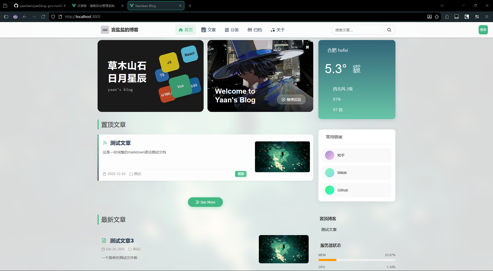
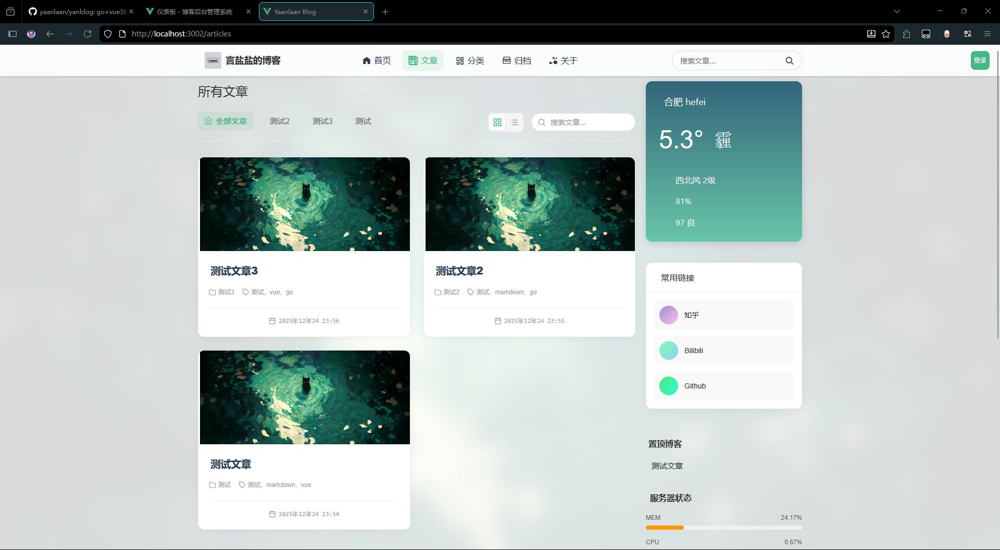
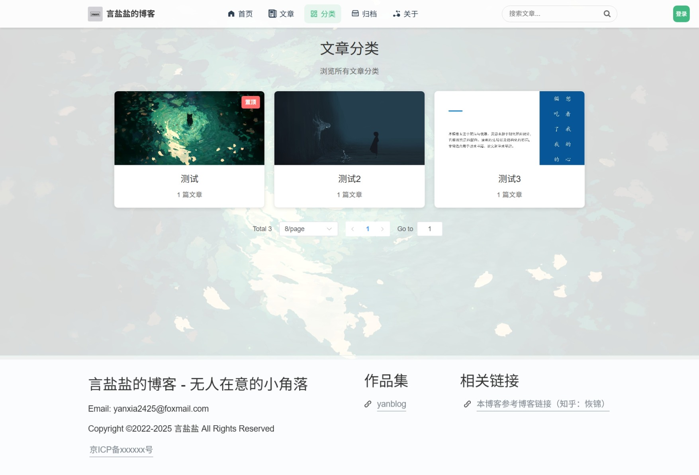
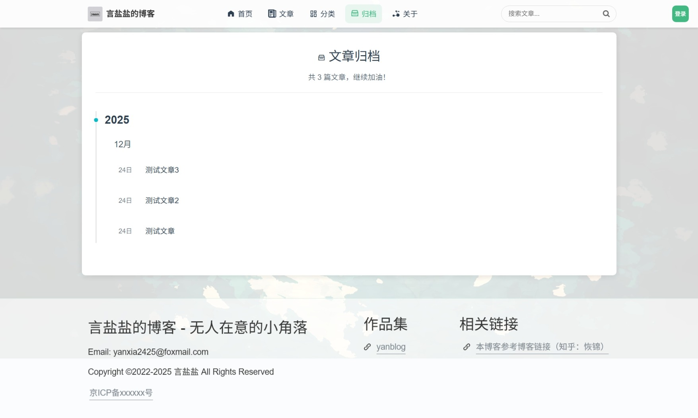
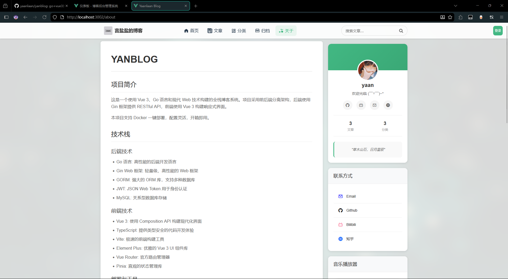


### 后端

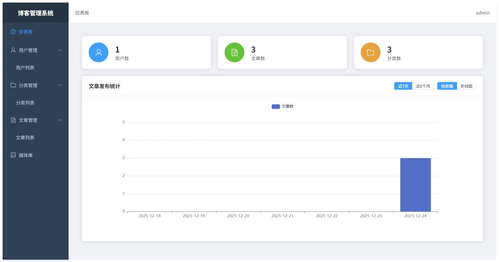
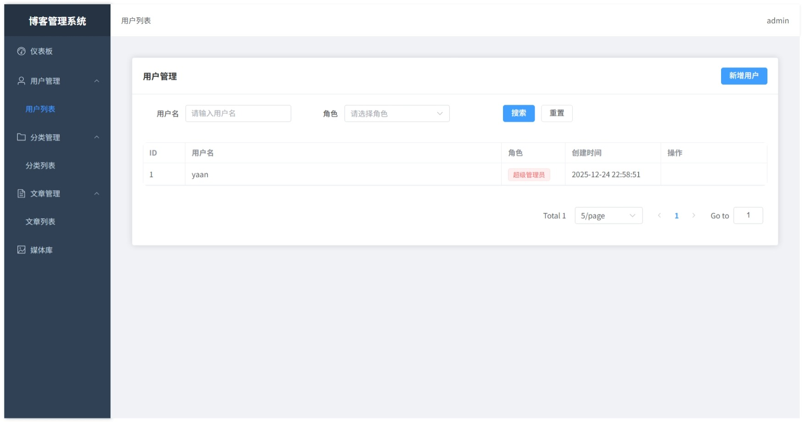
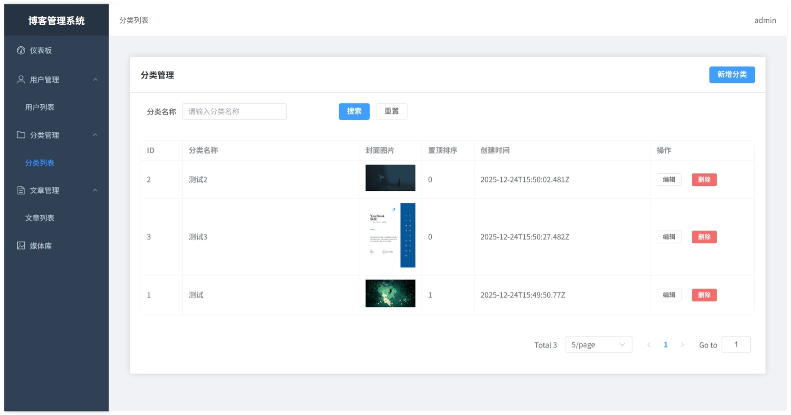
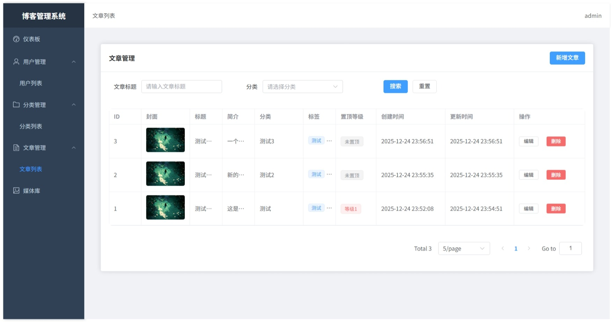
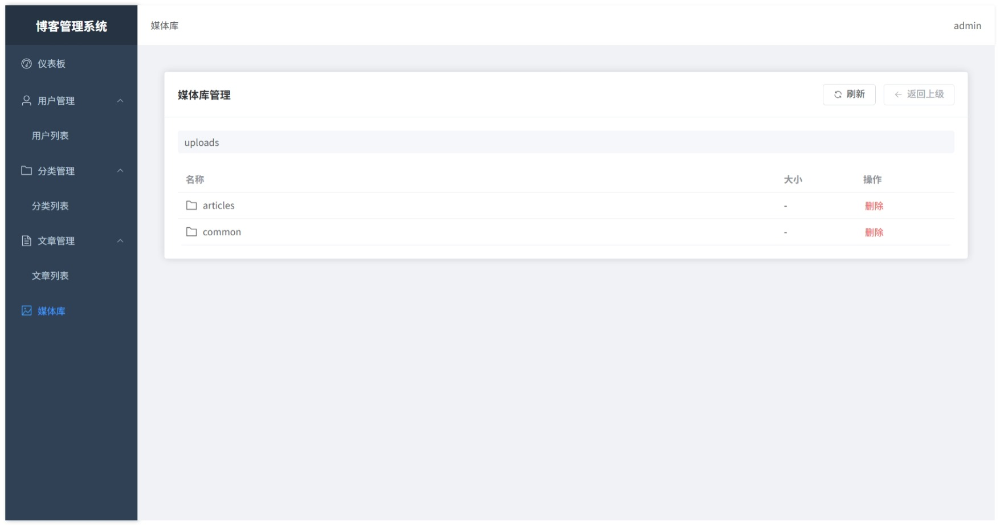
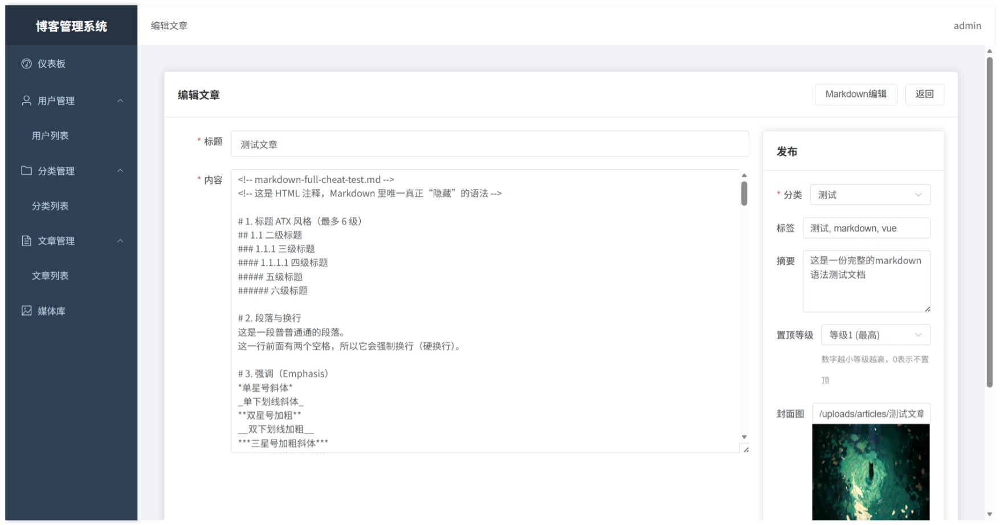
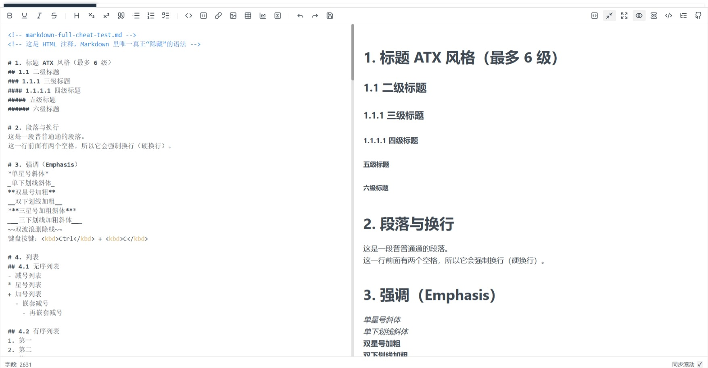
