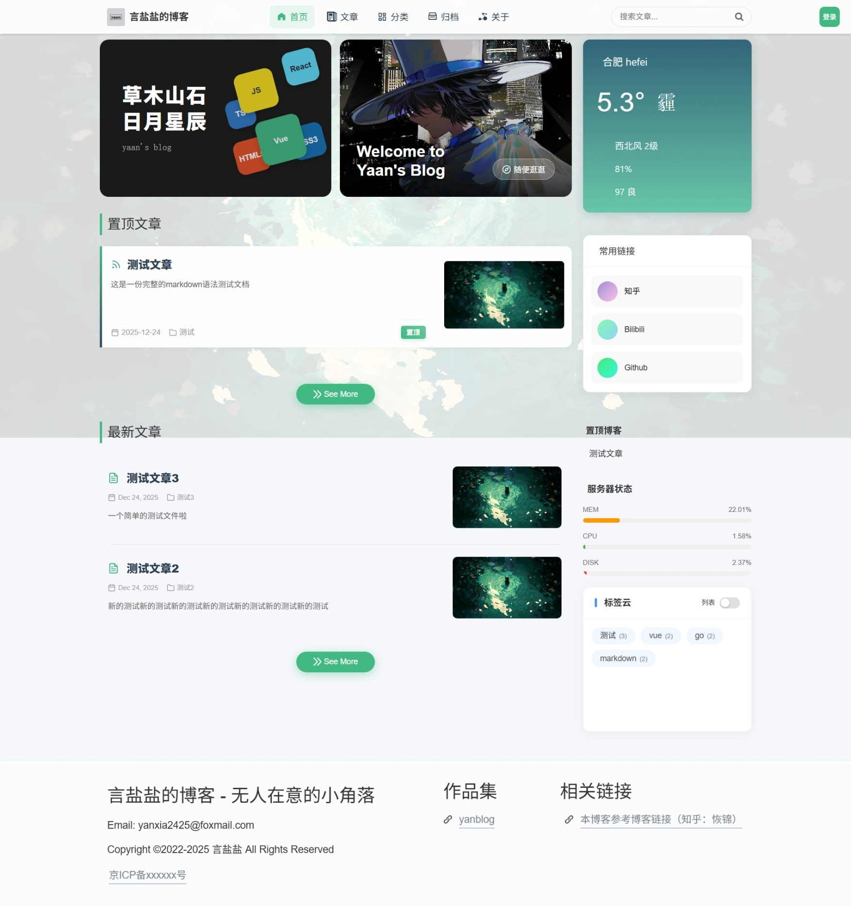
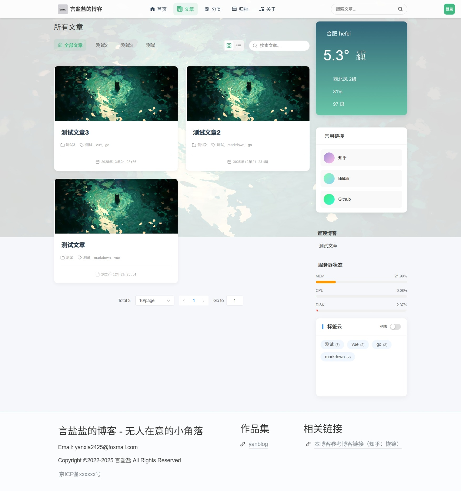
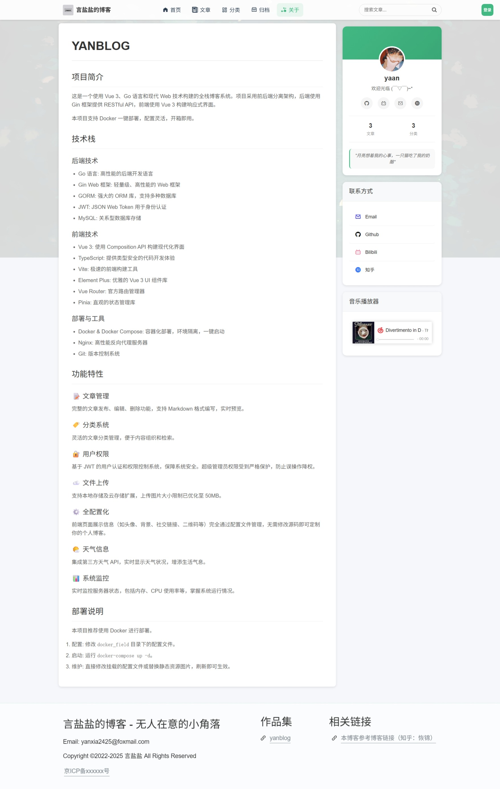

# Go+Vue 前后端分离博客系统

[原项目链接](https://github.com/wejectchen/Ginblog.git)

后端主要参考了 ginblog，由于原教程是 22 年的有一些东西不一样了，同时我也希望设计一些更丰富的功能。

## 项目简介

这是一个使用 Go 语言和 Vue.js 构建的前后端分离博客系统。后端采用 Gin 框架，前端使用 Vue 3 + TypeScript + Vite 构建。支持 Docker 一键部署。

## 功能特性

### 后端功能

- 用户管理（注册、登录、权限控制）
- 文章管理（创建、编辑、删除、分类）
- 分类管理
- 文件上传
- 天气信息获取
- 系统状态监控
- JWT Token 认证
- RESTful API 设计

### 前端功能

- 响应式设计，适配不同设备
- 文章列表展示与分类筛选
- 文章详情页面
- 侧边栏展示天气信息、置顶文章、标签云、服务器状态
- 管理后台（用户、文章、分类管理）
- 实时服务器状态显示
- 搜索功能
- **全配置化管理**：头像、背景图、Logo、二维码等均可通过配置文件修改，无需修改代码。

## 快速开始 (Docker 部署)

这是最推荐的部署方式，简单快捷。

### 1. 准备配置文件

在项目根目录下，你需要准备好配置文件。

**后端配置：**
将 `config/config_template.yaml` 复制并重命名为 `docker_field/backend/config.yaml`，并填入你的数据库信息、JWT 密钥等。

**前端配置：**
前端配置文件位于 `docker_field/frontend/config.yaml`。
如果你不想在部署后修改，请提前编辑此文件，配置你的博客名称、头像路径、背景图等。

### 2. 启动服务

确保你已经安装了 Docker 和 Docker Compose，然后在项目根目录下运行：

```bash
docker-compose up --build -d
```

### 3. 访问服务

启动成功后，你可以通过以下地址访问：

- **博客前台**: [http://localhost:3002](http://localhost:3002)
- **后台管理**: [http://localhost:3001](http://localhost:3001)
- **后端 API**: [http://localhost:8080](http://localhost:8080)

### 4. 后续维护

- **修改前端配置**：直接编辑 `docker_field/frontend/config.yaml`，保存后刷新浏览器即可生效。
- **修改关于页面**：直接编辑 `docker_field/frontend/static/about.md`，支持 Markdown 语法。保存后刷新浏览器即可看到更新，无需重启容器。
- **更换图片资源**：将图片放入 `docker_field/frontend/static/` 目录（例如 `avatar.jpg`），然后在配置文件中引用 `/static/avatar.jpg`。
- **修改后端配置**：编辑 `docker_field/backend/config.yaml`，保存后需要重启后端容器：`docker-compose restart backend`。
- **数据备份**：
    - 数据库数据位于 `docker_field/mysql/data`
    - 上传的文件位于 `docker_field/uploads`

## 本地开发构建

如果你想自己从源码构建或进行二次开发。

### 后端

1. 克隆项目
2. 安装依赖：`go mod tidy`
3. 配置数据库：修改 `config/config.yaml`
4. 运行项目：`go run main.go`

### 前端 (Web/Frontend & Web/Backend)

前端分为前台 (frontend) 和后台管理 (backend) 两个项目。

1. 进入目录：`cd web/frontend` 或 `cd web/backend`
2. 安装依赖：`npm install`
3. **配置文件**：
    - 本地开发时，前台使用的是 `public/config.yaml`。
4. 运行开发服务器：`npm run dev`
5. 构建生产版本：`npm run build`

## 项目结构

```
yanblog/
├── api/                # API 接口实现
├── config/             # 本地开发配置文件
├── docker_field/       # Docker 部署挂载目录 (配置、数据、静态资源)
│   ├── backend/        # 后端生产配置
│   ├── frontend/       # 前端生产配置 & 静态资源
│   ├── mysql/          # 数据库数据
│   └── uploads/        # 上传文件存储
├── deploy/             # Docker 构建辅助文件
├── model/              # 数据模型
├── routers/            # 路由配置
├── web/                # 前端代码
│   ├── frontend/       # 博客前台 (Vue3 + TS)
│   └── backend/        # 后台管理 (Vue3 + TS)
├── main.go             # 程序入口
├── docker-compose.yaml # Docker 编排文件
└── Dockerfile          # 后端构建文件
```

## 技术栈

- **后端**: Go, Gin, GORM, MySQL, JWT
- **前端**: Vue 3, TypeScript, Vite, Pinia, Element Plus, Axios
- **部署**: Docker, Docker Compose, Nginx

```bash
cd web/frontend（backend）
```

2. 安装依赖

```bash
npm install
```

3. 运行开发服务器

```bash
npm run dev
```

## API 文档


详细的 API 接口文档请查看 [apidoc.md](apidoc.md)

## 配置说明

项目使用 YAML 格式进行配置，主要配置项包括：

- 服务器配置（端口、运行模式等）
- 数据库配置（地址、用户名、密码等）
- 天气 API 配置

## 部署

1. 构建前端项目

```bash
cd web/frontend
npm run build
```

2. 将构建产物部署到服务器
3. 配置反向代理（如 Nginx）将前端请求代理到后端

## 预览

### 前端
===由于是整页捕获的，所以有些下半是白色，但其实正常不会==







### 后端


