# YanBlog

Go + Vue 3 前后端分离个人博客系统，支持暗黑模式、Markdown 编辑、Docker 一键部署。

## 快速开始

### Docker 部署（推荐）

```bash
# 1. 准备配置（可选，不创建则使用默认模板）
cp config/config_template.yaml config/backend/config.yaml
# 编辑 config/backend/config.yaml，修改 JwtKey

# 2. 启动
docker compose up -d --build
```

访问：
- 前台：`http://localhost:3002`
- 后台：`http://localhost:3011`
- 默认账号：`admin` / `123456`

### 本地开发

```bash
# 后端
go run main.go                         # :8080

# 前台
cd web/frontend && npm install && npm run dev   # :5173

# 后台
cd web/backend && npm install && npm run dev    # :3001
```

## 技术栈

| 层级 | 技术 |
|------|------|
| 后端框架 | Go + Gin + GORM |
| 数据库 | SQLite（开发）/ MySQL（生产） |
| 认证 | JWT + bcrypt 密码加密 |
| 前端 | Vue 3 + TypeScript + Vite |
| 后台 UI | Element Plus |
| Markdown | marked + KaTeX + Mermaid + highlight.js |
| 安全 | 登录限流（SQLite 持久化）、CORS、JWT 强密钥 |

## 功能

- **文章系统** — Markdown 编辑、分类、标签、置顶、阅读量、ZIP 批量上传
- **暗黑模式** — 跟随系统 / 手动切换，无闪烁，全组件主题适配
- **3D 标签云** — 斐波那契球分布、滚轮缩放（50%-200%）、拖拽旋转、动态密度优化
- **代码块** — Mac 风格、语法高亮、行号、一键复制
- **全配置化** — 博客名、Logo、头像、社交链接、页脚等全部通过后台可视化配置
- **文件管理** — 上传、批量操作、拖拽、目录管理
- **用户权限** — 超级管理员 / 管理员 / 普通用户，角色隔离
- **安全加固** — JWT 强密钥、登录限流（SQLite 持久化、5次失败锁定5分钟）、CORS 白名单
- **SEO** — 自动生成 sitemap.xml
- **响应式** — 适配桌面端和移动端
- **性能优化** — 数据库索引优化、前端代码分割、静态资源缓存

## 项目结构

```
├── api/v1/           API 接口
├── config/
│   └── config_template.yaml   后端配置模板
├── middlewares/      中间件（JWT、CORS、日志、限流）
├── model/            数据模型
├── routers/          路由
├── utils/            工具函数
├── web/
│   ├── frontend/     博客前台
│   └── backend/      管理后台
├── Dockerfile
├── docker-compose.yaml
└── main.go           入口
```

## 安全特性

- 🔐 **JWT 强密钥** — 64 位随机密钥，防止 Token 伪造
- 🛡️ **登录限流** — 5 次失败锁定 5 分钟（SQLite 持久化，容器重启不丢失）
- 🔒 **密码加密** — bcrypt 成本因子 12
- 🌐 **CORS 白名单** — 生产环境限制来源域名
- 📊 **数据库索引** — 9 个关键索引，优化查询性能与防注入

## 配置

首次运行自动从 `config/config_template.yaml` 读取默认配置。创建 `config/backend/config.yaml` 可覆盖：

```yaml
server:
  AppMode: release          # debug / release
  HttpPort: :8080
  SiteUrl: https://blog.example.com  # CORS 白名单（必填）

database:
  Db: SQLite                # SQLite / MySQL
  DbName: yanblog.db

JwtKey: <your-random-key>   # openssl rand -hex 32（必填）
```

前端配置（博客名、头像、社交链接等）在后台 **配置管理** 页面中可视化编辑，或直接修改 `config/frontend/config.yaml`。

## 预览

### 前台

<div align="center">
  <h4>首页</h4>
  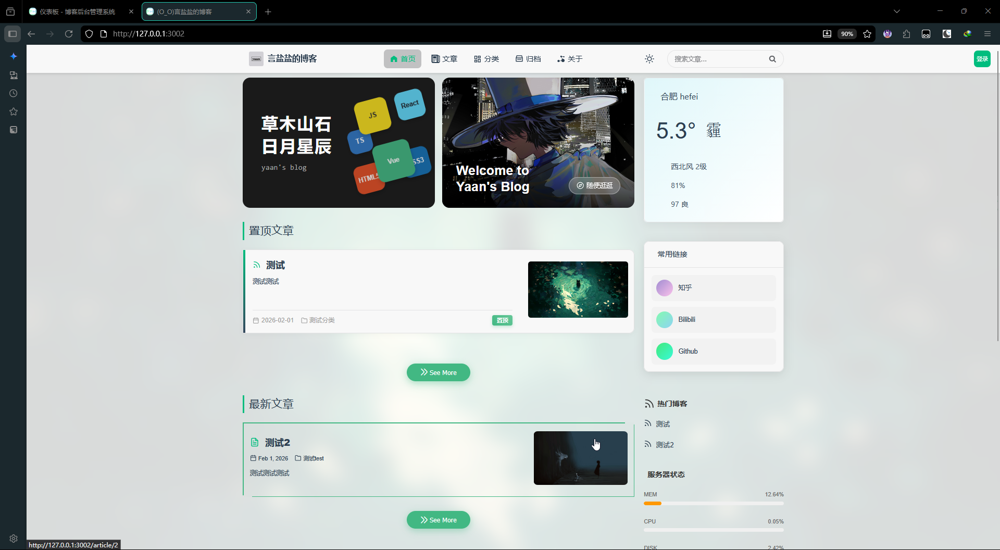
  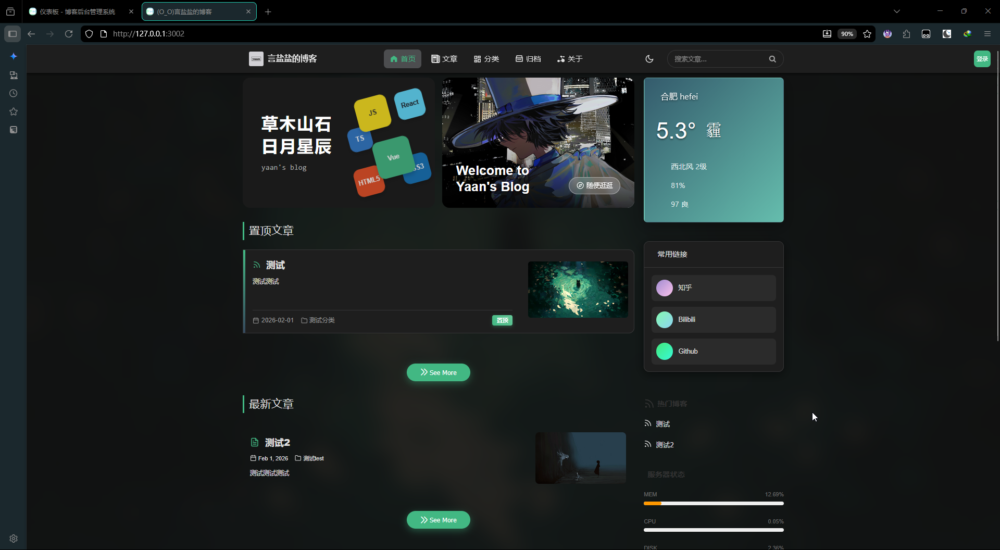

<h4>文章列表</h4>
  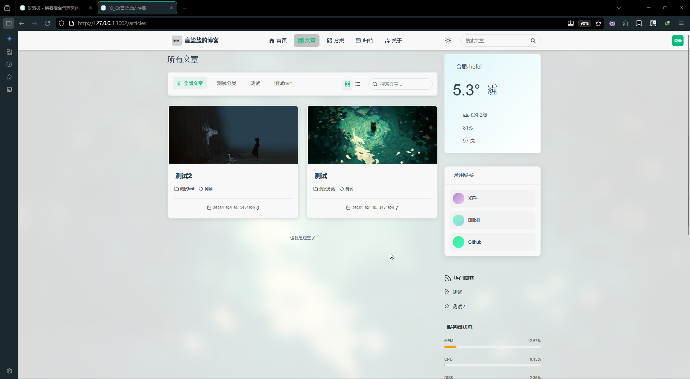
  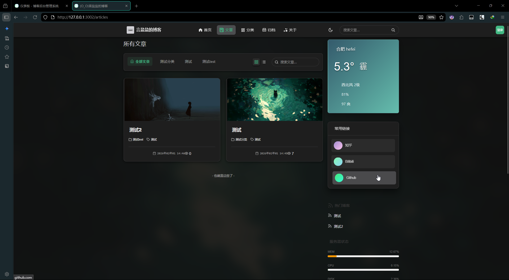

<h4>文章详情</h4>
  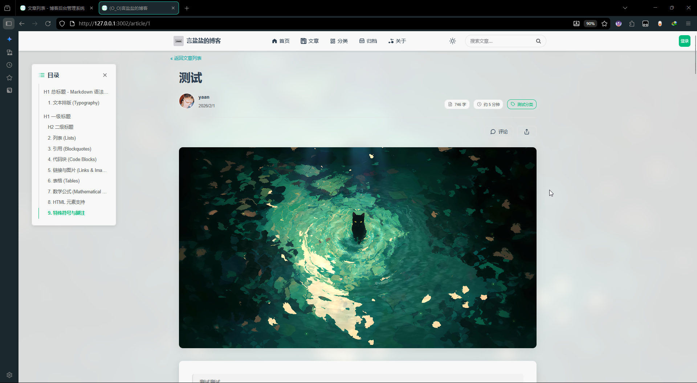
  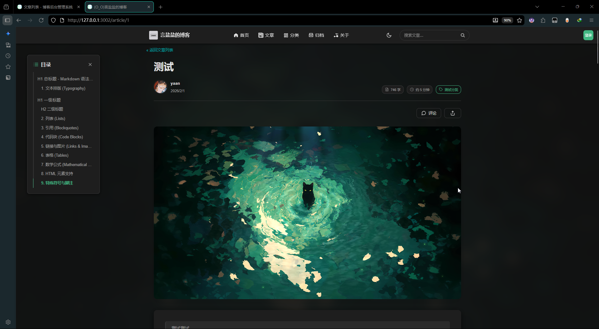

<h4>文章归档</h4>
  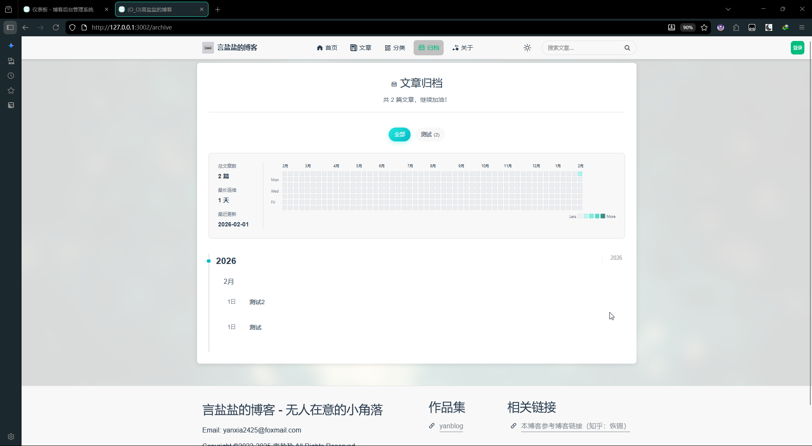
  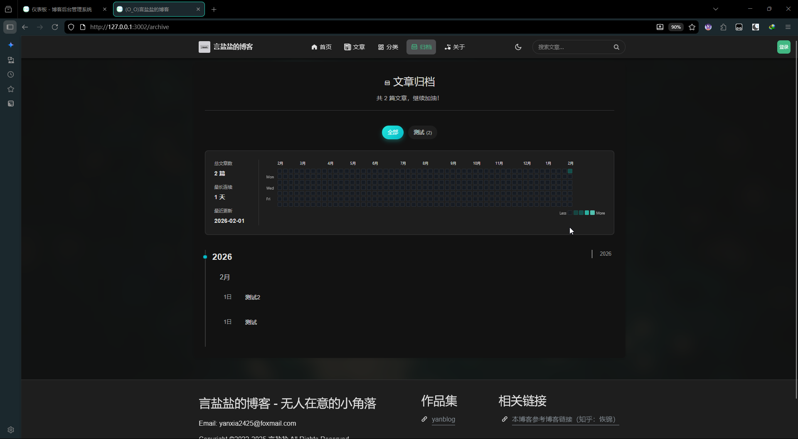

<h4>关于页面</h4>
  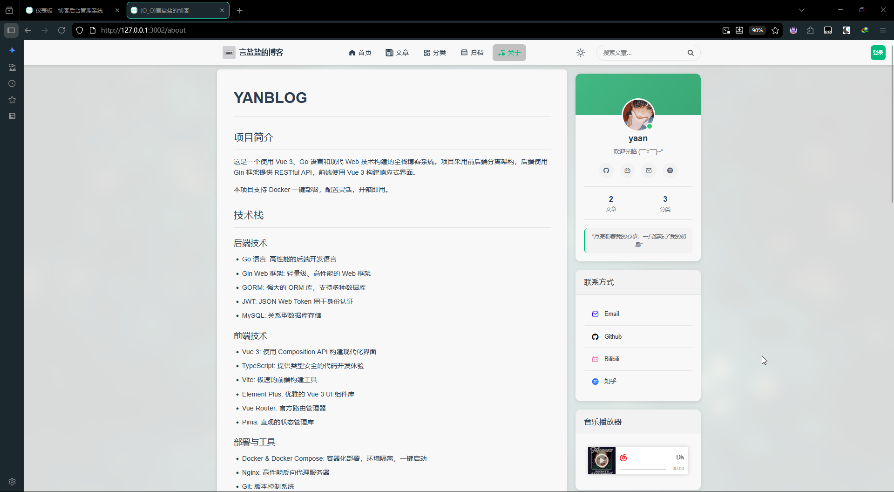
  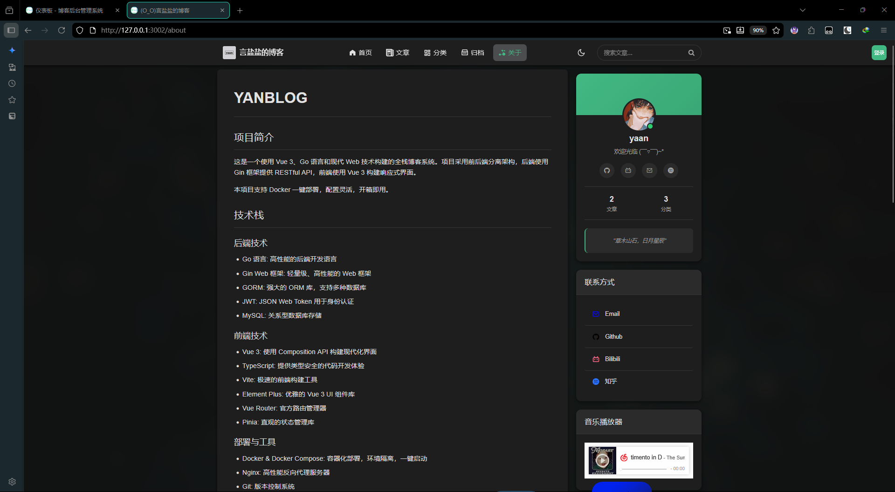
</div>

### 后台

<div align="center">
  <h4>仪表盘</h4>
  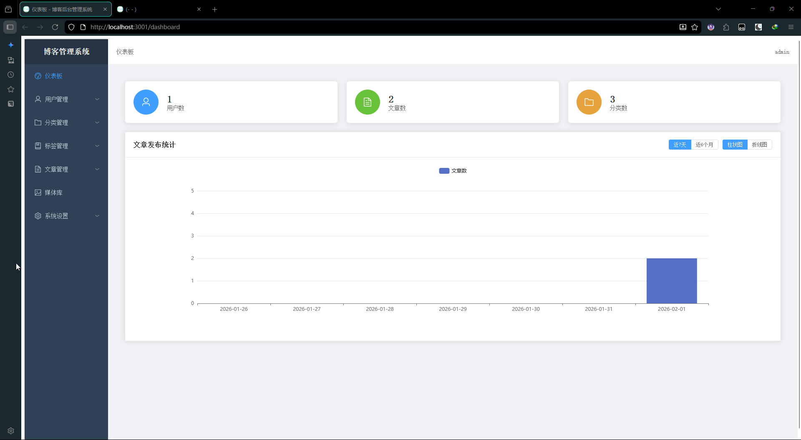
</div>
