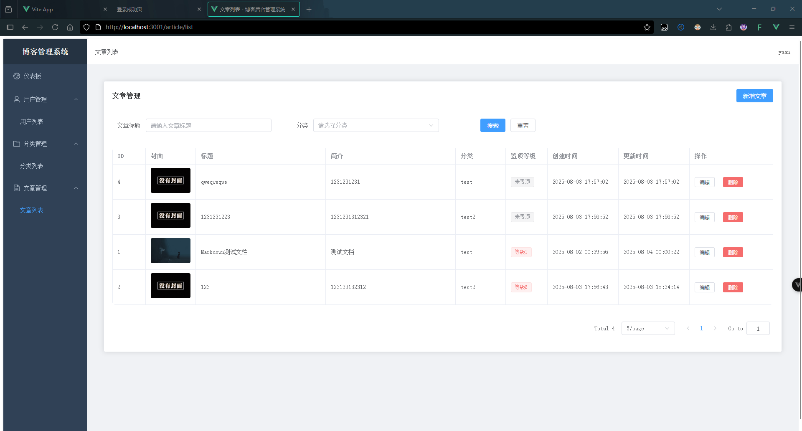

# Go+Vue的前后端分离博客

[原项目链接](https://github.com/wejectchen/Ginblog.git)

后端主要参考了ginblog，由于原教程是22年的有一些东西不一样了，同时我也希望设计一些更丰富的功能

## 项目简介

这是一个使用 Go 语言和 Vue.js 构建的前后端分离博客系统。后端采用 Gin 框架，前端使用 Vue 3 + TypeScript + Vite 构建。

## 功能特性

### 后端功能

- 用户管理（注册、登录、权限控制）
- 文章管理（创建、编辑、删除、分类）
- 分类管理
- 文件上传
- 天气信息获取
- 系统状态监控
- JWT Token 认证
- RESTful API 设计

### 前端功能

- 响应式设计，适配不同设备
- 文章列表展示与分类筛选
- 文章详情页面
- 侧边栏展示天气信息、置顶文章、标签云、服务器状态
- 管理后台（用户、文章、分类管理）
- 实时服务器状态显示
- 搜索功能

## 技术栈

### 后端

- Go 语言
- Gin Web 框架
- GORM ORM 库
- MySQL 数据库
- JWT 用户认证
- YAML 配置文件

### 前端

- Vue 3 (Composition API)
- TypeScript
- Vite 构建工具
- Vue Router 路由管理
- Axios HTTP 客户端
- CSS3 + Flexbox 布局

## 项目结构

```
yaanlaan_blog/
├── api/                # API 接口实现
│   └── v1/             # v1 版本 API
├── config/             # 配置文件
├── middlewares/        # 中间件
├── model/              # 数据模型
├── routers/            # 路由配置
├── utils/              # 工具函数
├── web/                # 前端代码
│   └── frontend/       # 前端页面
├── └── backend/        # 后端管理页面
├── main.go             # 程序入口
├── go.mod              # Go 模块定义
└── go.sum              # Go 模块校验和
```

## 安装与运行

### 后端

1. 克隆项目

```bash
git clone <项目地址>
```

2. 安装依赖

```bash
go mod tidy
```

3. 配置数据库
   在 `config/config.yaml` 中配置数据库连接信息
4. 运行项目

```bash
go run main.go
```

### 前端

1. 进入前端目录
   frontend和backend相同

```bash
cd web/frontend（backend）
```

2. 安装依赖

```bash
npm install
```

3. 运行开发服务器

```bash
npm run dev
```

## API 文档


详细的 API 接口文档请查看 [apidoc.md](apidoc.md)

## 配置说明

项目使用 YAML 格式进行配置，主要配置项包括：

- 服务器配置（端口、运行模式等）
- 数据库配置（地址、用户名、密码等）
- 天气 API 配置

## 部署

1. 构建前端项目

```bash
cd web/frontend
npm run build
```

2. 将构建产物部署到服务器
3. 配置反向代理（如 Nginx）将前端请求代理到后端

## 预览

### 前端


### 后端




