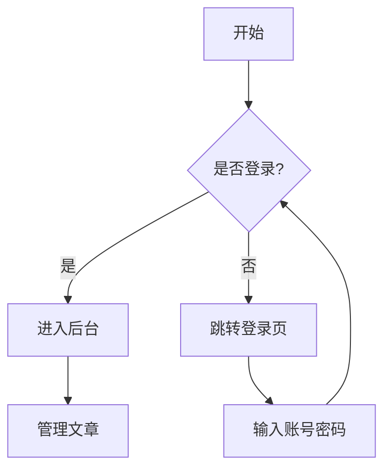
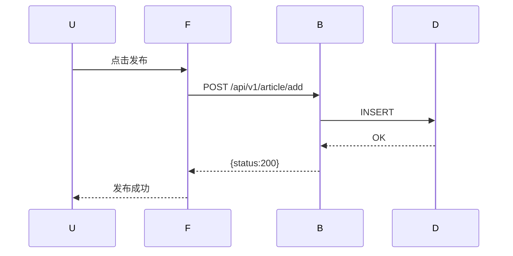

## 文本样式

支持 **粗体**、*斜体*、`行内代码`、~~删除线~~。

## 列表

- 第一项
- 第二项
  - 嵌套子项
- 第三项

1. 步骤一
2. 步骤二
3. 步骤三

## 引用

> 这是一段引用文字。
> 可以有多行。

## 链接卡片

单独一行的链接会自动渲染为卡片样式：

https://github.com

## 表格

| 功能 | 描述 | 状态 |
|------|------|------|
| 代码块 | Mac 风格 + 高亮 + 行号 | 已支持 |
| 公式 | KaTeX 行内和块级 | 已支持 |
| 图表 | Mermaid 流程图 | 已支持 |

## 代码块

```go
package main

import "fmt"

func main() {
    fmt.Println("Hello, YanBlog!")
}
```

```javascript
for (let i = 1; i <= 100; i++) {
  if (i % 15 === 0) console.log("FizzBuzz")
  else if (i % 3 === 0) console.log("Fizz")
  else if (i % 5 === 0) console.log("Buzz")
  else console.log(i)
}
```

## 数学公式（KaTeX）

行内：$E = mc^2$，$a^2 + b^2 = c^2$

块级：

$$
\int_{a}^{b} f(x) \,dx = F(b) - F(a)
$$

$$
\sum_{n=1}^{\infty} \frac{1}{n^2} = \frac{\pi^2}{6}
$$

## 流程图（Mermaid）





---

以上就是 YanBlog 支持的所有 Markdown 语法特性。
