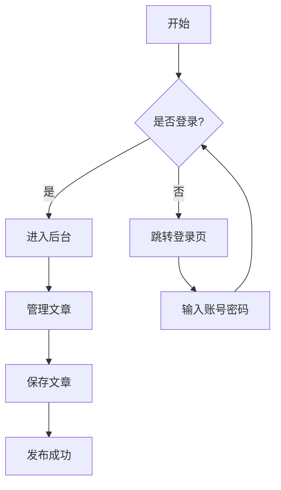
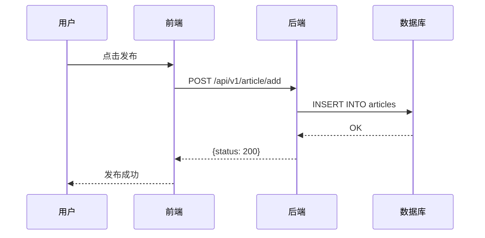

## 文本样式

支持 **粗体**、*斜体*、`行内代码`、~~删除线~~。

## 列表

无序列表：

- 第一项
- 第二项
  - 嵌套子项
  - 另一个子项
- 第三项

有序列表：

1. 步骤一
2. 步骤二
3. 步骤三

## 引用

> 这是一段引用文字。
> 可以有多行。
>
> — 作者

## 链接

[GitHub](https://github.com)

单独一行的链接会自动渲染为卡片样式：

https://github.com/yaanlaan/yanblog

## 表格

| 功能 | 描述 | 状态 |
|------|------|------|
| 代码块 | Mac 风格 + 高亮 + 行号 | 已支持 |
| 公式 | KaTeX 行内和块级 | 已支持 |
| 图表 | Mermaid 流程图 | 已支持 |
| 卡片 | 链接卡片 | 已支持 |

## 代码块

支持多种语言的语法高亮，Mac 风格界面，带行号和复制按钮。

```go
package main

import "fmt"

func main() {
    message := "Hello, YanBlog!"
    fmt.Println(message)
}
```

```javascript
// FizzBuzz
for (let i = 1; i <= 100; i++) {
  if (i % 15 === 0) console.log("FizzBuzz")
  else if (i % 3 === 0) console.log("Fizz")
  else if (i % 5 === 0) console.log("Buzz")
  else console.log(i)
}
```

```python
def fibonacci(n):
    a, b = 0, 1
    for _ in range(n):
        yield a
        a, b = b, a + b

for num in fibonacci(10):
    print(num)
```

```sql
SELECT u.username, COUNT(a.id) AS article_count
FROM users u
LEFT JOIN articles a ON a.uid = u.id
GROUP BY u.id
ORDER BY article_count DESC
```

## 数学公式（KaTeX）

行内公式：$E = mc^2$，以及 $a^2 + b^2 = c^2$。

块级公式：

$$
\int_{a}^{b} f(x) \,dx = F(b) - F(a)
$$

$$
\sum_{n=1}^{\infty} \frac{1}{n^2} = \frac{\pi^2}{6}
$$

$$
\begin{pmatrix}
a & b \\
c & d
\end{pmatrix}
\times
\begin{pmatrix}
e & f \\
g & h
\end{pmatrix}
$$

## 流程图（Mermaid）



时序图：



---

以上就是 YanBlog 目前支持的所有 Markdown 语法特性。你可以在后台管理面板中创建和编辑文章，或者通过 ZIP 文件批量上传。
